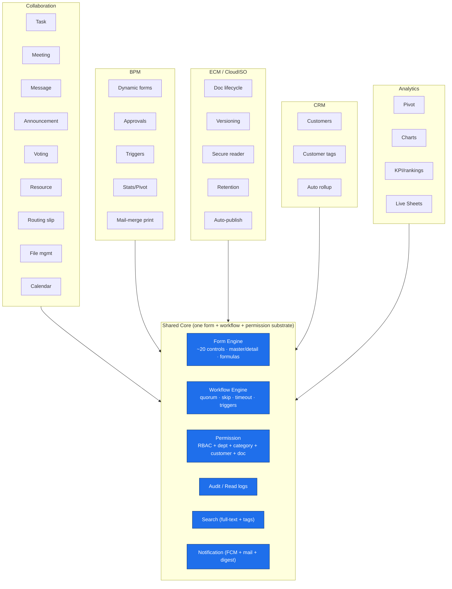
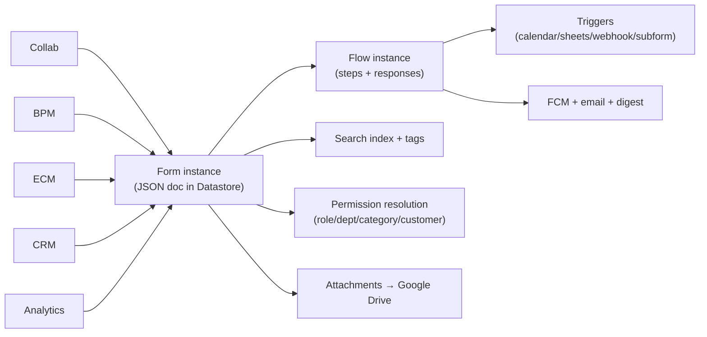

# Phase 1 — Product Capability Mapping

Every feature found in the inputs, classified into the five requested domains.
"Surface" = visible to end users; "Platform" = an engine capability the
features are built on. The right‑hand columns map each capability to the
engine that implements it (forward reference to Phases 2–6) and the evidence ID.

> Key insight from the manual (E‑BACKEND‑06, M §功能說明): **every feature —
> Collaboration *and* BPM — is internally "一張張的電子表單" (a form) with three
> states: input / summary / detail, managed by one form‑management substrate.**
> So the capability matrix below is wide, but it rides on a *single* form +
> workflow + permission core. That uniformity is the platform's central design
> bet.

---

## 1.1 Capability Matrix (master table)

### Collaboration (協同作業 / EIP)

| Capability | Sub‑features | Engine | Evidence |
|------------|--------------|--------|----------|
| **Task (交辦任務)** | Assign to self/others/dept/group; auto‑add to calendar; progress logs w/ attachments; due‑date push; "not‑done" alert to assigner | Form + Workflow + Notification + Calendar | E‑NOTIF‑01, E‑ASYNC‑02 |
| **Meeting (會議)** | Resource booking → resource‑mgr approval → attendee polling → convene decision → calendar → day‑of reminder → minutes + responses; full‑text searchable | Form + Workflow + Resource + Calendar + Search | E‑SEARCH‑01 |
| **Calendar (行事曆/時間管理)** | Month/week/day; integrates bulletins, meetings, tasks, votes, leave, resources, public events, **personal Google Calendar**; recurring events w/ push; scope filter by dept/member | Calendar + Google Calendar API + Permission | E‑AUTH‑03 |
| **Message (訊息)** | To self/others/dept/group/role; optional push; URL auto‑quote (thumbnail/summary); video/slides; unlimited attach; Line‑style threaded replies | Form + Notification | E‑FE‑05, E‑NOTIF‑01 |
| **Announcement (公告/公佈欄)** | Target person/role/dept/group; on/off‑shelf schedule → calendar; daily‑digest reminder; **read receipts** (who saw / who didn't); urgent push; bulletin‑manager approval | Form + Workflow + Notification + Audit | E‑NOTIF‑05, E‑SEC (read log) |
| **Voting (線上投票)** | Single/multi‑choice; named/anonymous; option editor; voting window → calendar; live pie/bar charts; post‑close discussion; vote‑manager approval | Form + Workflow + Analytics | E‑WF‑04 |
| **Resource (資源)** | Catalog‑tree of venues/equipment/people; request → resource‑mgr approval → calendar; calendar filter by resource type | Form + Workflow + Calendar | E‑FORM‑02 (資源樹) |
| **Routing slip (傳簽單)** | First router → each reader optionally names next router → continues until none | Form + Workflow (dynamic next‑actor) | E‑WF‑08 |
| **Notification (通知)** | One‑way must‑see; forced onto "to‑respond" home until opened; optional push | Form + Notification | E‑NOTIF‑03 |
| **File mgmt (檔案管理)** | Multi‑level folders; open‑to targets; movable folder; unlimited attach; full‑text on descriptions; comments + attachments | Form + ECM + Search | E‑SEARCH‑01 |
| **Dynamic home (動態首頁)** | Facebook‑style unified timeline of all info types; bumped on new reply; inline expand; quick‑filter tags; full‑text | UI + Search + Permission | E‑FE‑01, E‑SEARCH‑03 |
| **To‑respond home (待回應資訊)** | Aggregates must‑read messages + forms awaiting my signature; clears on read/sign | UI + Workflow + Permission | M §待回應資訊 |
| **Contacts (通訊錄)** | Member‑published profile fields; admins also see iOS/Android **bind tokens** | Member data + Permission | E‑AUTH‑04 |

### BPM (電子表單 / CloudBPM)

| Capability | Sub‑features | Engine | Evidence |
|------------|--------------|--------|----------|
| **Form (表單)** | ~20 controls; master + stats + 3 extra tables; computed fields (`@`/`=`); validation; responsive auto‑layout (phone/tablet/desktop); unlimited fields; per‑record unlimited attach + audio/photo/video; pivot stats | Form Engine | E‑FORM‑01..09 |
| **Workflow (流程)** | Sequential/parallel/any/all/ratio approval; consult; temp add‑sign/cc; in‑progress/withdraw/hold; reject‑to‑any‑step; sign‑time flow + content edits; form‑as‑approver; external‑program approval | Workflow Engine | E‑WF‑01..12 |
| **Approval (簽核/決行)** | 任一決/任一通過決/全員決/徵詢任一/徵詢全員/過半/超過¾; digital signature optional per step | Workflow Engine | E‑WF‑04 |
| **Audit trail (異動記錄)** | All flow mutations + content edits logged with original backup; sign history; read logs; proxy attribution | Audit substrate | E‑WF‑08, E‑WF‑09 |
| **Escalation / Timeout (時限/逾時)** | Per‑step deadline → auto‑approve / auto‑reject / mark‑overdue; swept every 30 min | Workflow + Cron | E‑WF‑06, E‑ASYNC‑02 |
| **Triggers (觸發程序)** | Calendar insert; leave insert; set proxy; add leave hours; member‑data math; modify content; call external service; Google Sheets read/append/delete; trigger sub‑form; set customer/filter tags; ISO doc ops | Workflow post‑hooks | E‑WF‑10, E‑INT‑04/05 |
| **Stats & report (統計與報表)** | Auto 2‑D pivot + interactive pie/bar; xlsx export; permission‑tiered; open source form from chart | Analytics | M §統計與報表 |
| **Form performance (表單績效分析)** | Cross‑form usage analytics over a period (admin/boss/form‑mgr only) | Analytics + Permission | M §表單績效分析 |
| **Mail‑merge print (套表列印)** | Default public template or per‑form Google‑Sheet template w/ tags → xlsx/PDF incl. photos & signatures | Document/Template engine | E‑FORM‑09 |
| **Form catalog (表單類別)** | Categories carry permission + managers; import/export by formId | Form Engine + Permission | E‑FORM‑10 |
| **30+ prebuilt forms** | Leave, attendance, appraisal, overtime, travel, headcount, memo, seal‑use, requisition, repair, complaint, feedback, expense, purchase/inspection, dispatch, construction log, supervision report, official inbound/outbound docs | Form templates | W §電子簽核 |

### ECM (文件管制 / CloudISO)

| Capability | Sub‑features | Engine | Evidence |
|------------|--------------|--------|----------|
| **Document lifecycle** | 制定→簽核→發行→改版→廢止 fully controlled; ISO 2015 aligned | Workflow + ECM | W §文件管制 |
| **Version (改版)** | Approved revision auto‑publishes on new effective date; revision notice form; calendar; full revision log for inventory | ECM versioning | W §改版 |
| **Access control (調閱控管)** | Secure web reader: no download/print, **dynamic watermark**, **GPS lock**, **IP lock**, **time‑window lock**, minute‑accurate view logging | Secure viewer + Permission | E‑SEC‑05 |
| **Metadata** | Per‑doc tags; numbering (auto or manual) per zone/folder; link sub‑files + related docs/forms/URLs | ECM metadata | W §制定 |
| **Retention / disposal (廢止)** | "即將廢止" notice 1 month before expiry; disposal notice form; calendar; disposal log | ECM + Cron | E‑ASYNC‑04 |
| **Read analytics (績效分析)** | Rank docs by read count or read minutes | Analytics | W §績效分析 |
| **Inventory (文件盤點)** | Filter + full‑text (incl. file content) to build internal/external audit lists | Search | E‑SEARCH‑02 |
| **Auto‑publish module** | Daily scan of a Google Drive folder + manifest → auto on‑shelf, auto/explicit numbering | ECM + Drive + Cron | W §文件自動上架 |
| **Built‑in PDF convert+encrypt server** | Converts uploads to encrypted PDF (free, built‑in) | Document conversion | E‑FILE‑05 |

### CRM (客戶管理)

| Capability | Sub‑features | Engine | Evidence |
|------------|--------------|--------|----------|
| **Customer (客戶)** | Up to tens of thousands; full profile, unlimited contacts; auto news/map lookup | CRM + Search | E‑DB‑07 |
| **Tag (客戶標籤)** | Any info tagged with a customer auto‑aggregates into that customer's stream — no separate "visit record" needed | Tagging + Permission | M §客戶管理 |
| **Communication / Activity** | Messages, meetings, service logs, travel, expense auto‑rolled up per customer | CRM rollup | M §自動匯整客戶資訊 |
| **Access** | Per‑customer owners (multi); non‑owners blocked; senior managers see all incl. info not shared to them | Permission | E‑SEC (客戶控管) |
| **API** | `appendCustomer`; customer selector via external URL / Google Sheet | Integration | E‑INT‑02, E‑FORM‑07 |

### Analytics (統計分析)

| Capability | Sub‑features | Engine | Evidence |
|------------|--------------|--------|----------|
| **Dashboard** | "待回應資訊" + dynamic timeline act as personal operational dashboards | UI | E‑FE‑01 |
| **Pivot (二維樞紐分析)** | Auto 2‑D pivot from any form's pivot‑flagged fields + count field | Analytics | M §統計與報表 |
| **Chart** | Interactive pie/bar auto‑generated from checkbox selection | Analytics | W §統計分析 |
| **KPI** | Document read‑count/minute rankings; form performance; vote results | Analytics | W §績效分析 |
| **Live Sheets stats** | Pivot/chart directly over a live Google Sheet | Analytics + Sheets | E‑INT‑05 |
| **Export** | All pivots/tables → xlsx for ERP/accounting import | Analytics | M §統計與報表 |

---

## 1.2 Capability heat‑map (depth of implementation)

**Maturity read (inferred):**

| Domain | Depth | Notes |
|--------|-------|-------|
| BPM / Workflow | **Very deep** | The flagship; the skip‑expression language, sign‑time flow mutation, weighted quorums and trigger library are unusually rich for an SMB product |
| Collaboration | **Deep** | Broad and uniform thanks to the "everything is a form" model |
| ECM / CloudISO | **Deep, vertical** | Strong lifecycle + secure reader; clearly aimed at ISO audits |
| Analytics | **Medium** | Pivot + charts are auto‑generated but bounded (2‑D pivot, pie/bar); no warehouse/BI |
| CRM | **Medium‑light** | Tag‑and‑rollup rather than a full sales pipeline; no opportunities/quotes lifecycle of its own |

---

## 1.3 What is *deliberately absent* (also a capability signal)

These gaps are themselves evidence about the architecture and the target market
(SMB, Taiwan/Greater China, audit‑driven):

- **No BI/warehouse, no 3‑D+ OLAP** — analytics stop at 2‑D pivot + pie/bar
  (M §統計與報表). Heavy reporting is offloaded to xlsx export → ERP.
- **No relational ad‑hoc query** — consistent with NoSQL Datastore (E‑DB‑02).
- **No per‑individual‑form permission** — permission is bound at the *category*
  level by deliberate design ("做到個別表單…用起來很麻煩", M §維護表單類別).
- **No self‑hosable artifact** — it is PaaS‑locked to Google (E‑CLOUD‑01..10);
  there is no on‑prem story, which becomes a compliance concern in Phase 11.
- **No formal e‑signature certificate chain** — "digital signature" here is a
  *biometric/evidence bundle* (selfie+sign+GPS+time, E‑SEC‑06), **not** PKI/CMS.
  This is the single biggest Part 11 gap, expanded in Phases 8 & 11.

---

## 1.4 Domain → engine traceability (one‑line summary)

Every one of the dozens of user‑facing capabilities collapses, at runtime, into
the same five primitives: **a JSON form document, an optional flow instance,
post‑step triggers, a search/tag index entry, and a permission envelope, with
blobs on Drive.** Phases 2–6 reverse‑engineer each primitive in turn.
