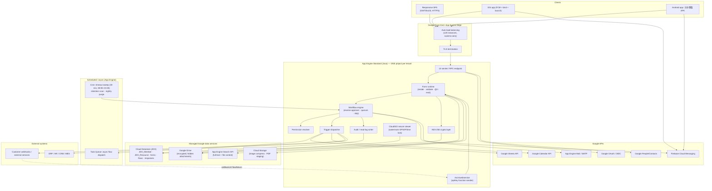
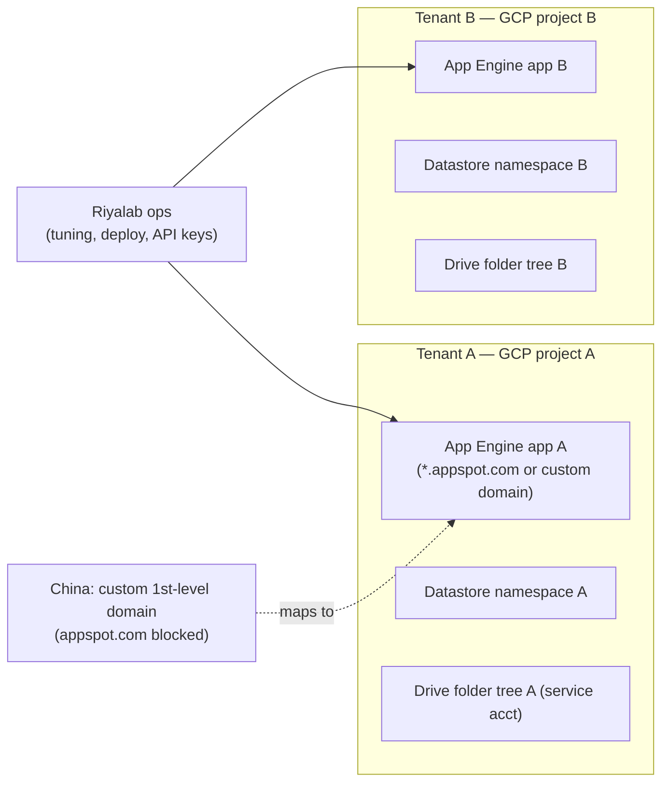

# Phase 2 — Architecture Reverse Engineering

Each layer is scored against the candidate technologies the brief listed.
Scores are **0–100 evidence strength** for that specific candidate (not a
probability that sums to 100). The *winner* per layer is bolded.

---

## 2.1 Frontend framework

| Candidate | Score | Reasoning |
|-----------|------:|-----------|
| **GWT (Google Web Toolkit)** | **62** | Best fit for the era + stack: a **Java** App Engine backend (E‑BACKEND‑01) paired with a Java‑to‑JS SPA was Google's own canonical 2012–2016 pattern; explains heavy tree/grid widgets + popup windows (E‑FE‑03), single responsive codebase (E‑FE‑02), and tight Datastore/RPC coupling. CloudGears generating GWT widgets from XML is very plausible (E‑BACKEND‑06). |
| ExtJS / Sencha | 55 | The grid/tree/window vocabulary (E‑FE‑03) and "彈出式視窗" match ExtJS almost perfectly; strong RWD + theming (E‑FE‑07). Slightly behind GWT only because the backend is Java and ExtJS would imply a JSON/REST seam that the API docs don't emphasise for the UI. |
| Angular | 30 | Plausible for a "SPA" buzzword (E‑FE‑01) but no Angular‑specific tells; the widget‑heavy, server‑metadata‑driven feel predates typical Angular apps. |
| Vue | 12 | No evidence; timeframe (appspot legacy) predates Vue adoption in this segment. |
| React | 12 | No evidence; same timing argument. |
| PrimeNG | 10 | Would imply Angular; no Angular evidence. |

**Verdict:** a **metadata‑driven widget‑toolkit SPA**, most likely **GWT or
ExtJS**, served as a single responsive bundle. The product markets itself as
"全新世代的 SPA" (E‑FE‑01) and the UI is unmistakably grid/tree/window‑centric
(E‑FE‑03). Confidence that it's *one of GWT/ExtJS*: **80**. Confidence in
*which* one: **~60**.

## 2.2 Backend

| Candidate | Score | Reasoning |
|-----------|------:|-----------|
| **Java (Servlet on App Engine Standard)** | **93** | `JDO_*` entity kinds (E‑BACKEND‑01) = Java Data Objects; epoch‑millis dates (E‑BACKEND‑02); `java.util.regex` validation (E‑BACKEND‑03); `/ecm/webservice` servlet path (E‑BACKEND‑05); appspot.com + scale‑to‑zero (E‑CLOUD‑02/03). Multiple independent JVM fingerprints. |
| Spring Boot specifically | 35 | It's Java, but the App Engine *standard* (gen‑1) + JDO pattern predates/avoids Spring Boot; more likely plain servlets + JDO/DataNucleus. Could have Spring as DI, but no tell. |
| .NET | 5 | Contradicted by JDO + appspot + Java regex. |
| Node.js | 6 | Contradicted by JDO + Java epoch + Java regex. |
| Python | 12 | App Engine also runs Python, but JDO/Java‑regex/Java‑epoch are Java‑specific, not Python. |

**Verdict:** **Java on Google App Engine Standard (gen‑1), servlet‑based, with
JDO/DataNucleus persistence.** Confidence **93**.

## 2.3 Database

| Candidate | Score | Reasoning |
|-----------|------:|-----------|
| **Google Cloud Datastore (Firestore in Datastore mode)** | **90** | `JDO_*` kinds (E‑DB‑01) are the textbook GAE‑Java + JDO + Datastore stack; schema‑less form evolution with no migration (E‑DB‑02) is NoSQL behaviour; JSON aggregate per form (E‑DB‑03); hierarchical string keys (E‑DB‑06); "tens of thousands" of customers searched not joined (E‑DB‑07). |
| Firestore (native mode) | 30 | Possible if modernised, but JDO points to Datastore mode specifically. |
| PostgreSQL | 8 | Contradicted by schema‑less evolution + JDO; no relational tells. |
| MySQL / Cloud SQL | 10 | The marketing "獨立的資料庫" could *sound* like a per‑tenant SQL DB, but JDO + zero‑migration form changes argue strongly against relational. |
| SQL Server | 3 | No evidence; wrong ecosystem. |

**Verdict:** **Cloud Datastore via JDO**, one logical datastore per tenant
project (E‑CLOUD‑08). The "獨佔資料庫" claim is realised as **one App Engine
project (hence one Datastore namespace) per customer**, not a per‑tenant RDBMS.
Confidence **90**.

## 2.4 Search engine

| Candidate | Score | Reasoning |
|-----------|------:|-----------|
| **App Engine Search API (`com.google.appengine.api.search`)** | **68** | All‑Google stack (no other infra named); cross‑entity full‑text over arbitrary fields (E‑SEARCH‑01/03) is exactly the Search API's document/index model; native to GAE‑Java; no ops needed (fits the "we manage ~10 servers for you" pitch, E‑CLOUD‑05). |
| ElasticSearch | 22 | Capable of all described features, but would be an *extra* managed cluster the company never alludes to; inconsistent with the pure‑PaaS story. |
| Lucene (embedded) | 18 | App Engine standard gen‑1 blocked raw filesystem/threads, making embedded Lucene impractical there → low. |
| Solr | 10 | Same ops objection as ElasticSearch; no evidence. |

**Verdict:** **App Engine Search API** as primary, with document **content
extraction** feeding it for CloudISO file‑content search (E‑SEARCH‑02).
Confidence **68** (this is the least‑certain layer).

## 2.5 File storage

| Candidate | Score | Reasoning |
|-----------|------:|-----------|
| **Google Drive** | **95** | Named explicitly and repeatedly (E‑FILE‑01/02); "encrypted & hidden" service‑owned files; client downloads directly from Google (bandwidth claim). |
| Google Cloud Storage | 45 | Almost certainly present too — for server‑side JPEG compression (E‑FILE‑04) and the PDF convert/encrypt pipeline (E‑FILE‑05), GCS is the natural staging tier. So **Drive + GCS hybrid**. |
| S3‑compatible | 3 | Contradicted by the all‑Google posture. |

**Verdict:** **Google Drive as the user‑visible blob store, with GCS as a
likely processing/staging tier.** Confidence in Drive **95**.

## 2.6 Authentication

| Candidate | Score | Reasoning |
|-----------|------:|-----------|
| **Google OAuth / OpenID Connect** | **88** | "使用 Google 帳號快速登入…交由 Google 執行" with OAuth popup (E‑AUTH‑01); unlocks Calendar/Contacts scopes (E‑AUTH‑03). |
| Local credential (custom) | 80 | Co‑exists: account+password, emailed temp password, AES‑256 stored (E‑AUTH‑02/06). So **dual auth**. |
| JWT/token session | 55 | Tap‑push‑no‑relogin (E‑NOTIF‑03) implies a persisted session/bearer token; classic GAE used server sessions, but a token is plausible. |
| SAML | 8 | No evidence. |
| LDAP | 6 | No evidence; cloud‑only posture. |

**Verdict:** **Hybrid auth — Google OAuth/OIDC + a local encrypted credential
store**, with **FCM device‑token binding** for mobile (E‑AUTH‑04). Confidence
**85** for the hybrid model.

---

## 2.7 Inferred system architecture (Mermaid)

---

## 2.8 Deployment topology & tenancy

**Tenancy model (inferred):** *physical* single‑tenant — **one App Engine
project + Datastore + Drive tree per customer** (E‑CLOUD‑07/08). This is the
literal meaning of "獨佔雲". Pros: blast‑radius isolation, per‑tenant data
residency, the "one hacked tenant ≠ all tenants" claim (W). Cons: per‑tenant
deploy/patch fan‑out, no shared‑nothing economies of scale, version drift
risk across the fleet (revisited in Phase 11).

---

## 2.9 Architecture characterisation (the one‑paragraph teardown)

CloudEIP is a **PaaS‑native, single‑tenant Java monolith on App Engine
Standard**, persisting **schema‑less JSON form aggregates in Cloud Datastore
(via JDO)**, keeping **blobs in Google Drive**, indexing with the **App Engine
Search API**, pushing via **FCM**, and orchestrating time‑based work with **App
Engine Cron + Task Queue** — all *generated* from the **CloudGears** XML
metadata engine. It is elegant and operationally cheap for its segment, but its
defining trait — **encrypted‑opaque JSON in NoSQL** — is simultaneously its
super‑power (zero‑migration dynamic forms) and the root of its compliance and
reporting limits (Phases 8 & 11).

> **Confidence summary:** Backend Java/App Engine **93** · Datastore **90** ·
> Drive **95** · OAuth+local hybrid **85** · Search API **68** · Frontend
> GWT/ExtJS family **80** (specific framework **~60**).
