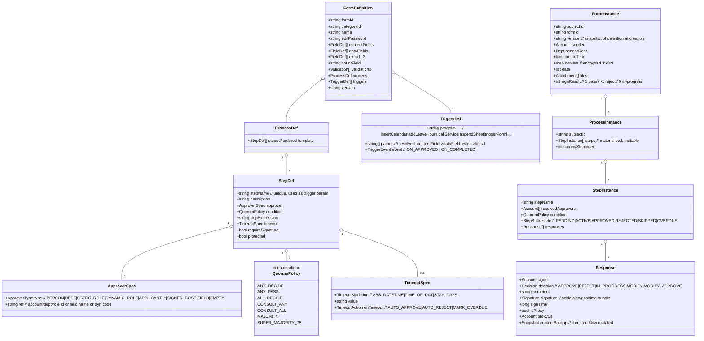
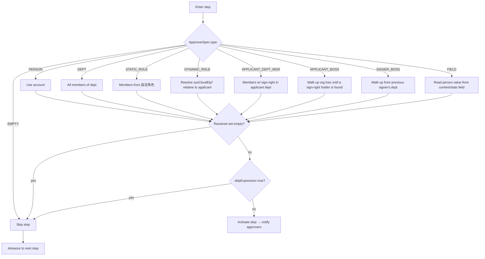
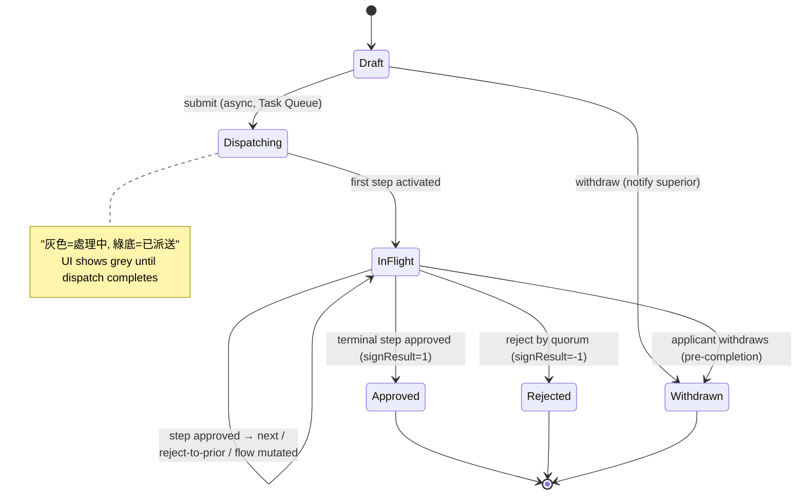
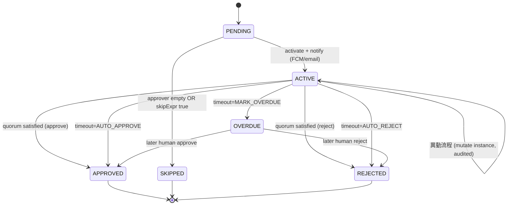
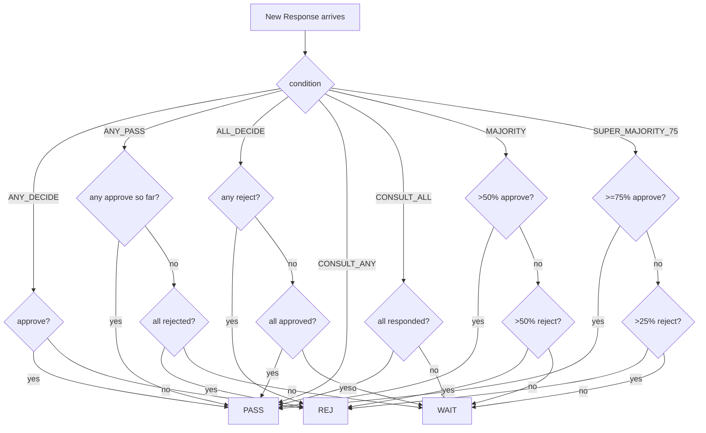
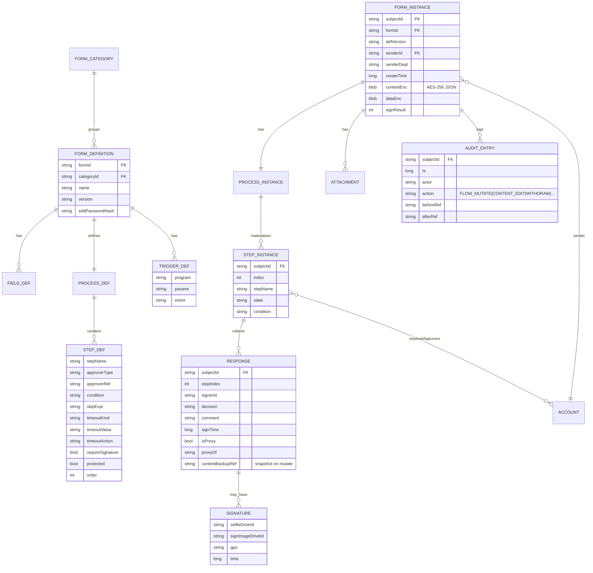
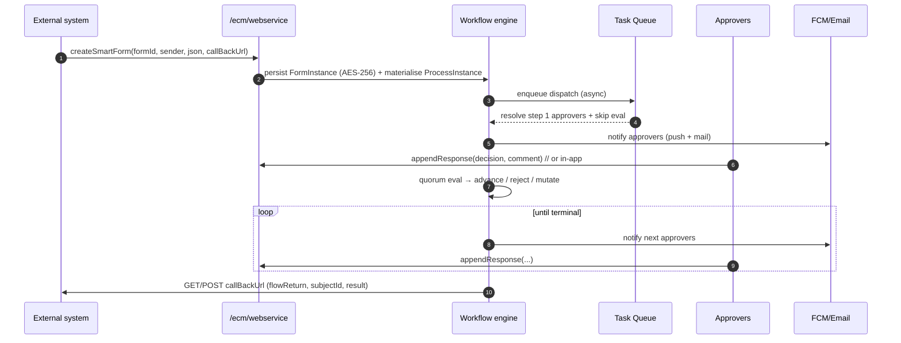

# Phase 3 — Workflow Engine Reverse Engineering

The workflow engine is CloudBPM's crown jewel. The manual exposes enough of its
behaviour (E‑WF‑01…12) to reconstruct its meta‑model, persistence, state
machine and API with high confidence.

---

## 3.1 Behavioural inventory (what the engine can do)

| Concept | Observed behaviour | Evidence |
|--------|--------------------|----------|
| **Approver — specific person** | Fixed account | E‑WF‑02 |
| **Approver — department** | All members of a dept must sign | E‑WF‑02 |
| **Approver — static role** | Members assigned in 設定角色 | E‑WF‑02 |
| **Approver — dynamic role** | Resolved relative to applicant at runtime; codes `sysCloudEipSender/Signer/Dept/Boss/SignerBoss` | E‑WF‑03 |
| **Approver — applicant‑relative** | 填單人 / 填單人部門全員 / 填單人部門主管 / 填單人上級主管 / 簽核者上級主管 | E‑WF‑02 |
| **Approver — data‑driven** | A content field or stats field whose value is a person (chosen via dept‑tree control) | E‑WF‑02 |
| **Approver — empty → skip** | If resolved approver is empty, step is skipped (not an error) | E‑WF‑02 |
| **Sequential approval (串簽)** | Steps run in order | E‑WF‑01 |
| **Parallel approval (會簽)** | Multiple approvers on one step | E‑WF‑04 |
| **Any‑decides (任一決)** | One approve passes; one reject rejects | E‑WF‑04 |
| **Any‑pass (任一通過決)** | Any approve passes; needs *all* reject to reject | E‑WF‑04 |
| **All‑decide (全員決)** | All must approve, else reject | E‑WF‑04 |
| **Consult any (徵詢任一)** | First opinion (approve or reject) advances | E‑WF‑04 |
| **Consult all (徵詢全員)** | Wait for all opinions, then advance regardless | E‑WF‑04 |
| **Majority (過半同意)** | >50% approve advances; >50% reject rejects | E‑WF‑04 |
| **Super‑majority (超過¾)** | ≥75% approve advances; >25% reject rejects | E‑WF‑04 |
| **Weighted/ratio approval** | Majority & ¾ are the realised "比例決" (ratio) policies | E‑WF‑04 |
| **Skip condition (滑步)** | Boolean expr; if true the step is skipped | E‑WF‑05 |
| **Timeout / escalation (時限)** | Per‑step deadline → auto‑approve / auto‑reject / mark‑overdue | E‑WF‑06 |
| **Auto‑approve / auto‑reject** | Timeout outcomes; leave a synthetic sign record | E‑WF‑06 |
| **Reject to any prior step** | Choose any earlier step to return to | E‑WF‑07 |
| **In‑progress (處理中)** | Pause holding the token, leaves a history entry | E‑WF‑07 |
| **Withdraw (抽單)** | Applicant withdraws; superior notified | E‑WF‑07 |
| **Sign‑time flow mutation (異動流程)** | Add‑sign/cc, insert/reorder steps, unlimited nesting, audited + backed up | E‑WF‑08 |
| **Sign‑time content edit (修改內容/並同意)** | Edit form during sign; audited + original backed up | E‑WF‑09 |
| **Form‑as‑approver (母單觸發子單)** | A sub‑form acts as an approval gate | E‑WF‑10 |
| **External‑program approval** | `appendResponse` API injects a decision | E‑WF‑10 |
| **Proxy / delegation (代理)** | Delegate signs as departed user, marked as proxy | E‑WF‑12 |
| **Triggers (觸發程序)** | Post‑step hooks on 通過 (approved) or 完畢 (approved‑or‑rejected) | E‑WF‑11 |
| **Protection (保護)** | Lock step from edit/delete during fill & sign | E‑WF‑01 |
| **Digital signature per step** | Require selfie/handwrite/GPS/time | E‑SEC‑06 |

---

## 3.2 Workflow meta‑model (class diagram)



**Key meta‑model insight:** there are **two layers** — a *template* (`StepDef`
in the `FormDefinition`) and a *materialised, mutable instance* (`StepInstance`
in the `ProcessInstance`). Sign‑time flow mutation (E‑WF‑08) edits the instance,
never the template; every mutation backs up the prior instance (the audit
spine). This separation is what lets "新舊格式並存" work for flows too.

---

## 3.3 Approver resolution (decision flow)



Two robustness behaviours stand out (E‑WF‑02, M §部門異動的影響):

1. **Empty‑approver = skip, not error** — makes flows resilient to org churn.
2. **Account‑id‑first matching** — even if a member's department changes or
   disappears, a pending form still reaches them, because routing keys on the
   account id, while roles are resolved *at execution time*. This is why the
   manual can promise "高度的容錯力".

---

## 3.4 Skip‑expression language (滑步)

The skip language is a small, **server‑evaluated boolean DSL** (E‑WF‑05). Its
grammar, reconstructed from the manual:

```
expr        := ternary | comparison | membership
ternary     := condition '?' expr ':' expr        // left‑to‑right ? : pairing
comparison  := operand op operand
membership  := operand ('in'|'!in') list
op          := '==' | '!=' | '>' | '>=' | '<' | '<='
operand     := number | '#empty' | func | bareNumber   // bare number ⇒ @resultValue() op number
func        := '@resultValue()'                         // count‑field numeric value
             | '@psFields(field)'                       // content field value
             | '@userFields(field)'                     // stats field value
             | '@fieldMax(field)' | '@fieldMin(field)'  // across repeating rows
             | '@fieldContains(field, value)'           // any row contains value
             | '@applicant()' | '@applicant(#dept)' | '@applicant(#role)'
             | '@role(roleId)'                          // members of role
             | '@signerId()' | '@approvers()' | '@approversId()'
```

Canonical recipes the manual ships (all real, paraphrased):

| Intent | Expression |
|--------|-----------|
| Skip if count‑field < 1000 | `<1000` (sugar for `@resultValue()<1000`) |
| Skip if applicant is a dept manager | `@applicant() in @role(sysCloudEipSigner)` |
| Skip if applicant plays a role | `@applicant() in @role(roleId)` / `roleId in @applicant(#role)` |
| Skip if previous signer plays a role | `@signerId() in @role(roleId)` |
| Avoid self‑approval | `@applicant() in @approvers()` |
| Avoid consecutive duplicate signer | `@signerId()==@approversId()` |
| Skip by applicant dept | `@applicant(#dept) in 業務部,行銷部` |
| Conditional (asset vs consumable thresholds) | `資產 in @psFields(採購類別)?@resultValue()<100000:@resultValue()<50000` |
| Negated `in` | `@applicant() in @role(部級主管)?false:true` |

> **Engineering note:** that `=`‑formulas are "handed to a JavaScript
> interpreter" (E‑BACKEND‑04) while skip uses this bespoke DSL implies **two
> distinct expression evaluators** in the engine — a JS engine for field
> computation and a hand‑rolled boolean evaluator for routing. Phase 11 flags
> this dual‑evaluator surface as a validation/security concern.

---

## 3.5 Workflow state machine

### 3.5.1 Form (subject) lifecycle



### 3.5.2 Step (instance) lifecycle



### 3.5.3 Quorum evaluation (per active step)



---

## 3.6 Workflow database schema (Datastore‑as‑inferred → ERD)

Datastore is schema‑less, but the *logical* model behind the JSON aggregates is
recoverable. Shown as an ERD for clarity; in reality each box is a Datastore
**kind** (entity), with child collections embedded in the parent JSON unless
they need independent querying.



**Persistence reading:**

- A **form instance is one aggregate** (`FORM_INSTANCE` + embedded
  `content/data/extra` JSON, AES‑256 encrypted — E‑DB‑03/04). This is why
  reporting is hard: the payload is opaque blob, not queryable columns.
- **Responses & audit entries are append‑only** — the manual repeatedly stresses
  "會留下完整記錄…修改前原始資料也會備份" (E‑WF‑08/09). That's an event‑log discipline
  bolted onto a document store.
- **Subject‑id encodes time + sequence** — e.g. `createFormTest-20200102-1`,
  `test-20200427-2` → `formId-yyyymmdd-seq`. Acts as a human‑readable key and a
  natural Datastore ancestor for the flow/response children.

---

## 3.7 Workflow API (reconstructed)

From the published web service (E‑INT‑01/02/03) plus engine behaviour:

| Operation | API | Notes |
|-----------|-----|-------|
| Create instance (programmatic 起單) | `function=createSmartForm` + `formId`, `sender`, `json`, `callBackUrl` | JSON body mirrors `getSubjectData` output; GET≤8192 chars else POST |
| Read instance (full JSON) | `function=getSubjectData&id=<subjectId>` | Returns the canonical JSON aggregate |
| Update instance content | `function=updateSmartForm&subjectId=<id>&json=<...>` | Same body shape |
| Inject approval (external program approval) | `function=appendResponse&sender=&subjectId=&decision=1|-1&comment=` | One call per signer for 全員決 |
| Completion callback (outbound) | `callBackUrl` ← `function=flowReturn&subjectId=&result=1|-1` | Webhook on terminal state |
| Per‑step outbound hook | trigger "呼叫外部 service" (GET/POST) → `sender,subjectId,result(1/-1/0)` | Fires on configured 通過/完畢 |
| Append customer | `function=appendCustomer&customerId=&customerTitle=` | CRM write |
| Read org/resource trees | `function=getXml&type=JDO_Member|JDO_Resource` | XML metadata dump |

### Sequence — programmatic start → flow → callback



---

## 3.8 Versioning & audit (Part 11 lens — previews Phase 11)

| Property | CloudEIP today | Gap vs 21 CFR Part 11 / ISO 13485 |
|----------|----------------|-----------------------------------|
| Definition versioning | Instance snapshots `defVersion`; old/new coexist (E‑DB‑02) | OK in spirit; **no immutable, signed definition revision register** |
| Instance audit | Append‑only responses + before/after backups (E‑WF‑08/09) | Good, but stored **in the same mutable Datastore**, not a tamper‑evident/WORM log |
| E‑signature | Biometric/evidence bundle (E‑SEC‑06) | **Not** a cryptographic signature manifest binding *content hash + meaning + signer identity*; no §11.50/11.70 manifestation guarantees |
| Time source | Server epoch‑millis (E‑BACKEND‑02) | No trusted/synchronised timestamp authority |
| Reason‑for‑change | Free‑text comment | Not an enforced, coded reason on every record change |

These five rows are the seed of the NextGen workflow + e‑signature redesign in
Phase 8 and the remediation table in Phase 11.
