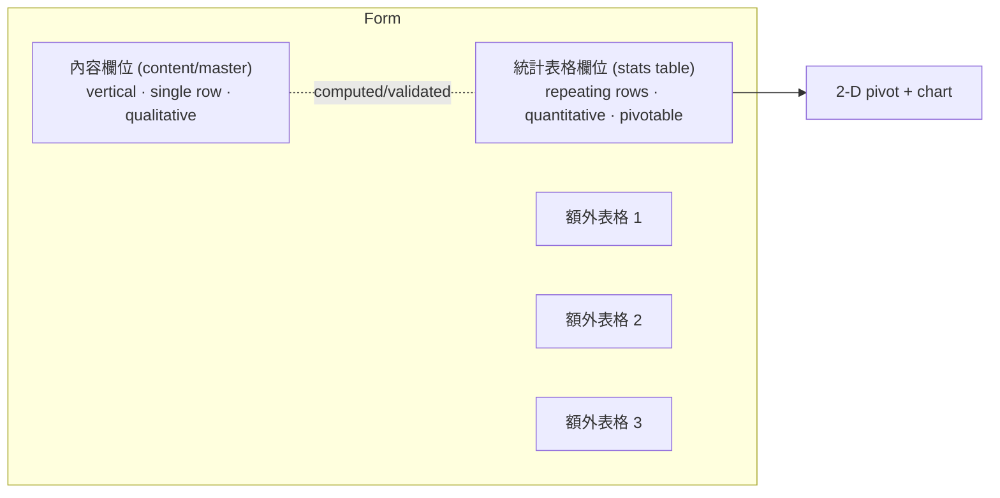
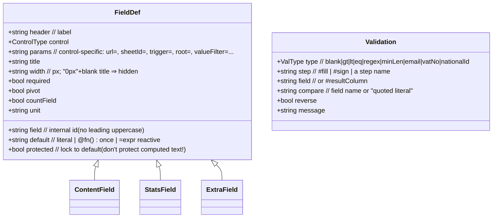
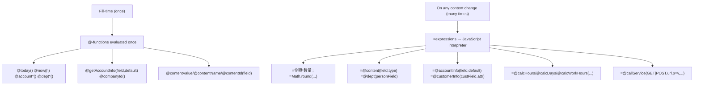
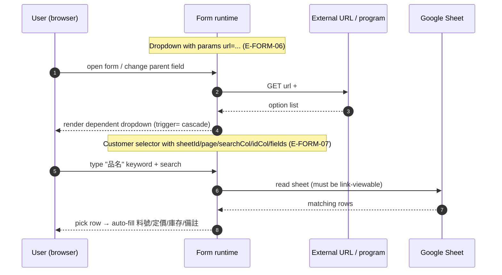
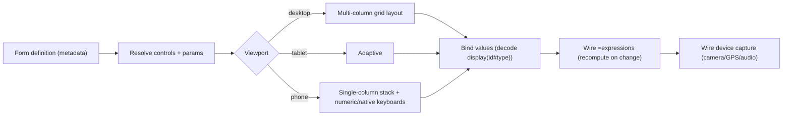
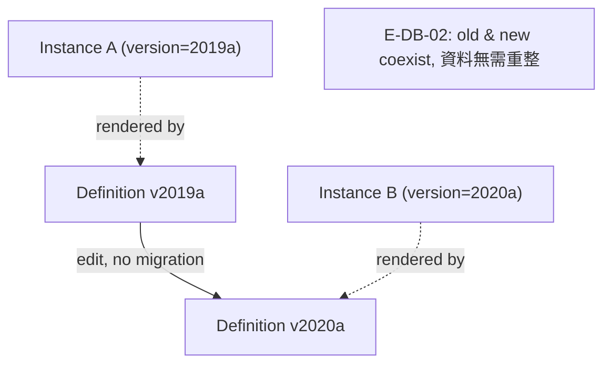
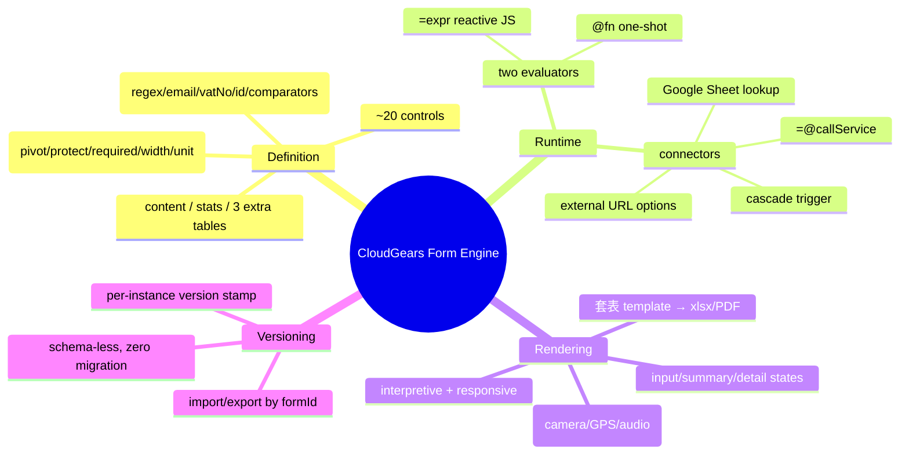

# Phase 4 — Dynamic Form Engine Reverse Engineering

CloudGears' form engine is the substrate under *every* feature (Phase 1). This
phase reconstructs its metadata schema, instance JSON, runtime/rendering
engines and versioning model from E‑FORM‑01…10 and the API examples.

---

## 4.1 Field‑type catalogue (the ~20 controls)

| Control (控制項) | Stored value shape | Server/Client behaviour | Evidence |
|------------------|--------------------|--------------------------|----------|
| 文字訊息 Text message | `"plain or <html>"` | Display‑only **and** the computation host: `=expr` recomputed on change via JS; params `color/bColor/headerColor/clickResult=#gpsLocation` | E‑FORM‑03, M |
| 單行文字 Single‑line | `"abc"` | Free text | E‑FORM‑02 |
| 多行文字 Multi‑line | `"1\n22\n333"` | `\n` line breaks | A |
| 數字 Number | `"1"` | int/float; min/max params; numeric keypad on mobile | M |
| 日期 Date | epoch‑millis string | `@empty()/@lastDayOfMonth(n)` defaults | E‑BACKEND‑02 |
| 日期時間 DateTime | epoch‑millis string | default snaps to nearest hour; minutes offset | M |
| 勾選框 Checkbox | `"1"`/`"0"` | boolean | A |
| 單選鈕 Radio | `名稱(id#unknown)` | single‑select; `@empty()` for no default | E‑FORM‑08 |
| 下拉選單 Dropdown | `名稱(id#unknown)` | options inline, or `url=` external, or cascade `trigger=` | E‑FORM‑06 |
| 多項選擇器 Multi‑select | `[名1(id1)]/n[名2(id2)]/n` | multi‑checkbox | E‑FORM‑08 |
| 選項編輯器 Option editor | `[AA(uuid)]/n…` | user‑authored option list reusable by other controls | M |
| 標籤編輯器 Tag editor | tag list | tagging | E‑FORM‑02 |
| 檔案上傳 File upload | `[name(driveId)]/n` | →Google Drive; mobile camera/mic/video | E‑FILE‑01 |
| 數位簽章 Digital signature | selfie+sign+gps+time bundle | non‑repudiation evidence | E‑SEC‑06 |
| 文件目錄 Doc folder | `[名(path#dept)]/n` | pick a folder node | A |
| 客戶選擇器 Customer selector | `客戶名(customerId)` | search inline / external URL / Google Sheet lookup‑populate | E‑FORM‑07 |
| 支出項目樹 Expense tree | `[名(id#account)]/n` | pick from expense subtree | E‑FORM‑02 |
| 資源樹 Resource tree | `[名(id#account)]/n` | pick from resource subtree; `url=` external | M |
| 部門組織樹 Dept/org tree | `[名(path#dept|#account)]/n` | person/dept/role/group picker; params `multiSelect/root/valueFilter/withMember/withGroup/allMemberCheck` | M |
| 連結表單 Link form | linked subjectId(s) | parent↔child form linking; `defaultType=` | M |

**Three structural buckets** every form has (E‑FORM‑01):



---

## 4.2 Form metadata schema (definition)

Reconstructed from field properties (E‑FORM‑04), validation (E‑FORM‑05) and the
CloudGears XML member‑schema example (E‑BACKEND‑07: `<text/> <textbox/>
<editor/>` with `field/header/width`). The form definition is metadata, almost
certainly stored as a CloudGears XML/JSON descriptor:

```jsonc
{
  "formId": "expenseClaim",          // unique; import overwrites by id (E‑FORM‑10)
  "categoryId": "finance",           // permission bound here (Phase 5)
  "name": "費用申請單",
  "editPassword": "<hash>",          // protects definition (M)
  "subjectTemplate": "@today() @account() 新增「@contentValue(title)」",
  "hideSubject": false,

  "contentFields": [
    {
      "field": "applyDept",          // internal id; first char not uppercase (M)
      "header": "所屬部門",           // display label
      "control": "deptTree",
      "default": "@deptWithId()",    // @ = compute once at fill
      "params": "valueFilter=#dept",
      "title": "所屬部門",
      "width": "140px",
      "required": true,
      "protected": false,
      "pivot": false,
      "unit": ""
    },
    {
      "field": "amount",
      "header": "金額",
      "control": "number",
      "default": "=Math.round(單價*數量)", // = = recompute on change (JS)
      "pivot": false
    }
  ],

  "dataFields": [                    // repeating rows; pivotable
    { "field": "expenseItem", "control": "expenseTree", "pivot": true },
    { "field": "subtotal", "control": "number", "countField": true, "unit": "元" }
  ],
  "countField": "subtotal",          // the numeric column stats aggregate

  "extraSheet1": "額外1", "額外1": [ /* FieldDef[] */ ],

  "validations": [
    { "type": "blank",     "step": "#fill",  "field": "applyDept", "message": "請選擇部門" },
    { "type": "email",     "step": "#sign",  "field": "contactEmail" },
    { "type": "regex",     "field": "vatNo", "compare": "\"^\\d{8}$\"" },
    { "type": "gt",        "field": "#resultColumn", "compare": "\"0\"", "reverse": false }
  ],

  "process":  { /* StepDef[] — see Phase 3 */ },
  "triggers": [ /* TriggerDef[] — see Phase 3/6 */ ],
  "version":  "2020a"
}
```

### Field descriptor (class view)



---

## 4.3 Form instance JSON (runtime payload)

This is the *actual wire/storage format*, taken verbatim from the API docs
(E‑FORM‑08, E‑DB‑03) and generalised:

```jsonc
{
  "version": "2020a",                 // ONLY required field for createSmartForm
  "subject": "這是主題",
  "content": "這是內容<br>111<br>222", // html allowed
  "contentFields": [ {                // master — one object
      "訊息文字": "這是訊息文字",
      "勾選框": "1",
      "部門樹＿部門": "[人事部(root/man/HR#dept)]/n[財會部(root/man/MONEY#dept)]/n",
      "日期時間": "1578033000000",
      "下拉選單": "台北(taipei#unknown)",
      "選項編輯器": "[AA(0D5E4AFF-...)]/n[BB(63C8E95A-...)]/n",
      "資源樹": "[手機(rDevice/phone#account)]/n",
      "客戶選擇器": "瑞研網技(riyalab)",
      "檔案上傳": "[排水道.jpg(2E7A2805-...)]/n"
  } ],
  "dataFields": [ { /* row 1 */ }, { /* row 2 */ } ],  // repeating
  "countField": "數字",
  "extraSheet1": "額外1", "額外1": [ /* rows */ ], "countField1": "數字",
  "extraSheet2": "額外2", "額外2": [ /* rows */ ], "countField2": "數字",
  "attachFiles": []
}
```

**Value‑encoding grammar** (self‑describing strings inside JSON — E‑FORM‑08):

| Pattern | Meaning | Example |
|---------|---------|---------|
| `名稱(id#unknown)` | single choice w/ id | `台北(taipei#unknown)` |
| `[名(id)]/n…` | list (even single item ends with `/n`) | `[AAA(a)]/n[BBB(b)]/n` |
| `名(path#dept)` | department | `業務部(root/sales#dept)` |
| `名(path/acct#account)` | person | `業務經理(root/sales/sales0#account)` |
| `name(driveId)` | attachment | `排水道.jpg(2E7A2805-...)` |
| epoch‑millis | date/time | `1578033000000` |

> The `#unknown` suffix on dropdown/radio ids is a strong tell that the engine
> stores a **discriminated value union** — `display(id#type)` — so the same
> parser handles options, people, depts, resources and customers. One encoder,
> many control types: classic low‑code engine economy.

---

## 4.4 Two‑phase formula engine



Two evaluators, two trigger phases (E‑FORM‑03, E‑BACKEND‑04):

- **`@fn()` — fill‑time, one‑shot.** Resolves identity/date/company context.
  Used in defaults and the subject template.
- **`=expr` — reactive.** Whenever a field changes, the string after `=` is
  handed to a JavaScript interpreter, so authors get the full JS standard
  library (`Math.round`, etc.) plus CloudGears `@`‑helpers that *return* values
  (e.g. `=@calcWorkHours(start,end,shift)` excludes holidays/breaks).

The fact that `=` runs through JS but **skip conditions** (Phase 3.4) use a
bespoke DSL means the platform has **two interpreters**. The `=@callService()`
helper is especially notable: a **form field can synchronously call an external
web service to populate itself** — a powerful but security‑sensitive seam
(Phase 11).

---

## 4.5 Dynamic options & connectors



Connector parameters the engine understands:

| Connector | Params | Notes |
|-----------|--------|-------|
| External option URL | `url=` (+ auto `#account*`/`#company*`) | dropdown/customer/resource tree |
| Cascade | `trigger=<otherField>` | re‑query dependent control |
| Google Sheet lookup | `sheetId=`, `page=`, `searchCol=`, `idCol=`, `fields=a:b,c` | sheet must be link‑viewable |
| Dept‑tree scoping | `root=`, `valueFilter=#dept|#account`, `multiSelect=`, `withMember/withGroup/allMemberCheck` | reusable picker |

---

## 4.6 Rendering engine — metadata‑driven responsive UI



Properties from the manual: a single responsive layout auto‑adapts to
phone/tablet/desktop (E‑FE‑02); width is `px` and `width:0px + blank title`
hides a field (M); horizontal vs vertical stats tables are a toggle; the same
definition renders the **input**, **summary** and **detail** states (Phase 1,
M §功能說明). The renderer is **interpretive** (reads metadata at runtime), which
is exactly why "新舊格式可同時並存" — each instance carries its own `version` and is
rendered by re‑reading whatever definition snapshot it points at.

---

## 4.7 Form version control



| Aspect | Mechanism | Evidence |
|--------|-----------|----------|
| Versioning unit | Whole form definition; instances stamp `version` | E‑FORM‑08 |
| Migration | **None required** — schema‑less store, interpretive renderer | E‑DB‑02 |
| Portability | Export/import by `formId`; same id overwrites | E‑FORM‑10 |
| Definition protection | `editPassword` gates read/modify | M |
| Coexistence | Each instance renders against its own snapshot | E‑DB‑02 |

**Trade‑off (Phase 11 hook):** zero‑migration is wonderful operationally but
means there is **no enforced, diffable, signed definition‑revision history** —
a problem for ISO 13485 document control and computerised‑system validation,
where you must prove *which exact form revision* produced a given record and
that the revision itself was reviewed/approved.

---

## 4.8 Template / mail‑merge sub‑engine (套表)

A second rendering path turns an instance into a pixel‑perfect xlsx/PDF via a
Google‑Sheet template (E‑FORM‑09):

| Tag family | Examples |
|------------|----------|
| Scalars | `#formName #sender #senderDept #subjectId #createDate #createTime #companyName #subject #content #footer` |
| Content cell | `#content(field,1,type,default,format)` (type ∈ M/N/T/D/CD/SD/S/B) |
| Stats cell | `#data(field,row,type,default,format)` ; `#sum(field)` |
| Extra tables | `#subSheet1..3`, `#subPrompt1..3`, `#subFieldsN(field,row,type,default)` |
| Signatures | `#signature(type,field,n,attr)`, `#signature(attr,n)` (attr ∈ photo/sign/gps/time) |
| Steps | `#step(item,step)` (item ∈ name/signer/comment/state/time/sign/hasForm) |
| Formula | `#formula(=sum(F10:F20))` injected literally |

The template tab **must** be named `template`; the sheet must be link‑viewable;
output is xlsx → optionally PDF (E‑FORM‑09). This is essentially a
**reporting/lettering DSL layered on Google Sheets** — clever, but it outsources
controlled‑document rendering to a consumer product (Phase 11 risk).

---

## 4.9 Form‑engine summary



The engine is genuinely advanced for its market. Its limits are not features but
*foundations*: opaque encrypted JSON (no relational query), no signed definition
history, dual interpreters, and consumer‑product (Sheets) coupling — each
carried into Phases 8–11.
