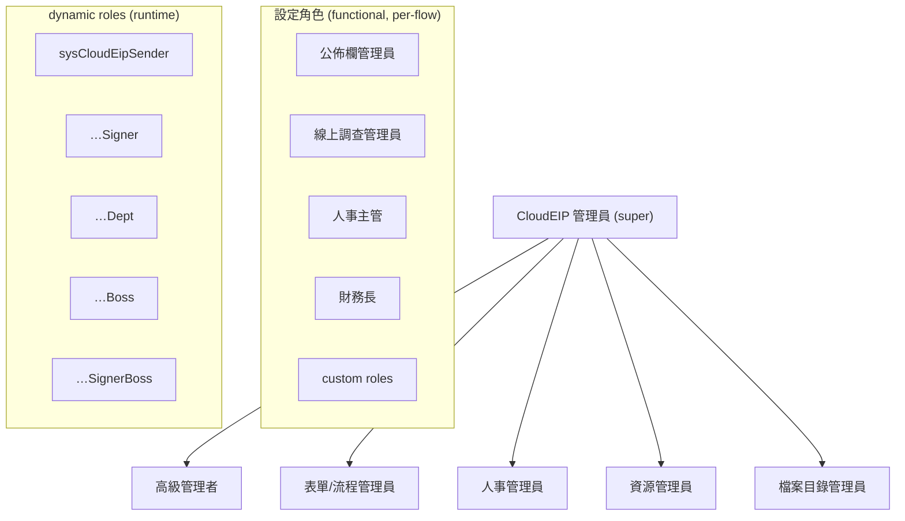
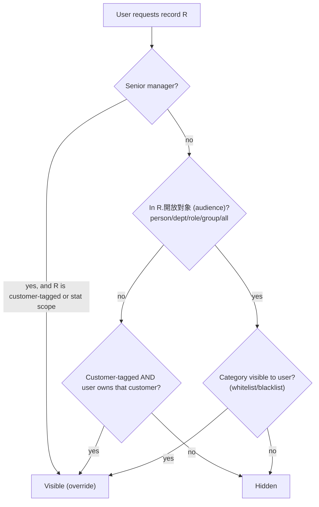
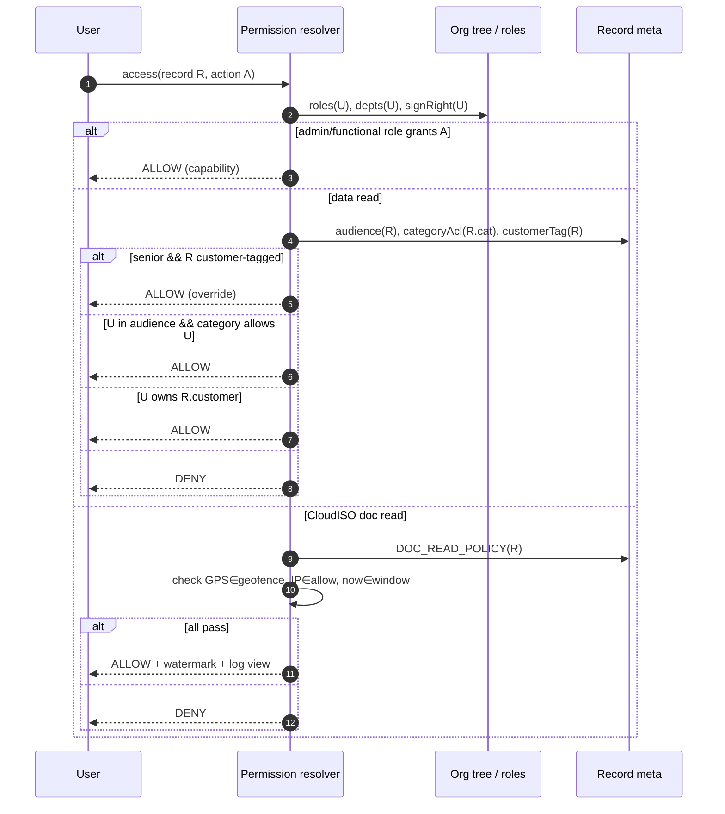

# Phase 5 — Permission Architecture

CloudEIP's authorization model is a **hybrid RBAC + attribute/relationship
model** layered over the org tree. It is not a single paradigm — it composes
five overlapping scopes. This phase reconstructs each, then the consolidated
matrix and the permission data design.

---

## 5.1 The five permission scopes (and which paradigm each is)

| Scope | Paradigm | Mechanism | Evidence |
|-------|----------|-----------|----------|
| **System/admin roles** | RBAC | Named admin roles set in 系統管理.設定管理員 | M §設定管理員 |
| **Functional roles** | RBAC | Roles in 組織管理.設定角色 (bulletin/vote/hr/cfo + custom), static or dynamic | M §設定角色 |
| **Department / sign‑right** | ABAC (relationship) | Org‑tree position + 簽核權 flag drive who can sign & who can stat | M §編輯部門, §統計與報表 |
| **Form‑category** | RBAC + ABAC | Category whitelists/blacklists members; category managers | E‑FORM‑10, M §設定表單類別權限 |
| **Customer** | ReBAC (ownership) | Per‑customer owners; non‑owners blocked; seniors override | E‑SEC (客戶控管) |
| **Per‑record audience** | DAC (discretionary) | Each info's 開放對象 (the author chooses viewers) | M §對象的選定 |
| **Document (CloudISO)** | ABAC (context) | GPS/IP/time‑window + watermark + no‑download on the reader | E‑SEC‑05 |

So the honest classification is: **RBAC for capabilities, ABAC/ReBAC for data
visibility, DAC for per‑record audience.** The manual is explicit that
permission is deliberately bound at the **category** level, not per individual
form, "because doing it per‑form looks impressive but is painful to use"
(M §維護表單類別) — a pragmatic design decision with compliance consequences
(Phase 11).

---

## 5.2 Admin & functional roles (RBAC layer)

| Role | Grants | Evidence |
|------|--------|----------|
| CloudEIP 管理員 (super admin) | Everything; assigns other admins; 取得 ApiKey; 進階系統設定 | M §設定管理員 |
| 高級管理者 (senior manager) | See **all** customers; run 統計與報表 across company | M |
| 表單/流程管理員 (form/flow admin) | 編輯電子表單 (definitions, flows, triggers) | M |
| 人事管理員 (HR admin) | All of 組織管理 except 編輯資源項目; member data; holidays; account approval | M |
| 資源管理員 (resource admin) | 編輯資源項目; approve resource/meeting bookings; edit quick‑filter tags | M |
| 檔案目錄管理員 (file‑dir admin) | Edit file‑management folders | M |
| 公佈欄管理員 / 線上調查管理員 (bulletin / vote) | Approve announcements / votes before publish | M §設定角色 |
| 人事主管 (hr) / 財務長 (cfo) | Default terminal approvers for HR/finance forms | M §設定角色 |
| Static role | Fixed assignees (person/multi/dept) | M |
| Dynamic role | Resolved per‑applicant: `sysCloudEipSender/Signer/Dept/Boss/SignerBoss` | E‑WF‑03 |

---

## 5.3 Data‑visibility model (the interesting part)

Three independent gates AND‑compose to decide if a user may see a record:

The **senior‑manager override** is the sharpest rule: a customer‑tagged record
is company property, so seniors can read it *even if its audience excludes them*
(M §嚴謹的客戶管控). That is a true ABAC rule (decision depends on the *attribute*
"is customer‑tagged" + the *role* senior), not plain RBAC.

### Statistics visibility tiers (record‑level, by sign‑right)

| Tier | Sees in 統計 | Evidence |
|------|-------------|----------|
| No sign‑right | Only own submissions | M §統計與報表 |
| Has sign‑right | Own department and all below | M |
| Category manager | Whole company for that category | M |

This is **record‑level** authorization derived from org position — pure ABAC.

---

## 5.4 Field‑ & document‑level controls

| Level | Control | Evidence |
|-------|---------|----------|
| **Field‑level** | `protected` locks a field to its default; `width:0px`+blank title hides it; "不允許填單人輸入" enforced via reverse blank‑check; computed fields read‑only | E‑FORM‑04, M §資料檢查 |
| **Field‑level (data privacy)** | Anonymous voting hides *which option* a member chose while recording *that* they voted | M §線上投票 |
| **Document‑level (CloudISO)** | Per‑zone publishers; per‑folder approval flows; reader policy: no‑download/print, dynamic watermark, **GPS lock**, **IP lock**, **time‑window lock**, minute‑accurate view log | E‑SEC‑05 |
| **Attachment‑level** | Files hidden in service‑owned Drive; download/print decision frozen at upload time | E‑FILE‑02, M §檔案下載方式 |

> Field‑level permission is **emergent**, not first‑class: there is no "user X
> may edit field Y" ACL — instead `protected`/hidden/reverse‑check approximate
> it. Phase 11 calls this out as a Part 11/field‑audit gap.

---

## 5.5 Consolidated permission matrix

Legend: ✅ full · 🟡 conditional (scope‑limited) · ➖ none.

| Capability \ Principal | Super admin | Senior mgr | Form/flow admin | HR admin | Resource admin | Category mgr | Signer (has sign‑right) | Member | Customer owner |
|---|---|---|---|---|---|---|---|---|---|
| Configure admins / ApiKey / 進階設定 | ✅ | ➖ | ➖ | ➖ | ➖ | ➖ | ➖ | ➖ | ➖ |
| Edit form definitions/flows/triggers | ✅ | ➖ | ✅ | ➖ | ➖ | ➖ | ➖ | ➖ | ➖ |
| Edit org/members/holidays, approve accounts | ✅ | ➖ | ➖ | ✅ | ➖ | ➖ | ➖ | ➖ | ➖ |
| Edit resources/tags, approve bookings | ✅ | ➖ | ➖ | ➖ | ✅ | ➖ | ➖ | ➖ | ➖ |
| Run 統計與報表 (company‑wide) | ✅ | ✅ | 🟡 | ➖ | ➖ | 🟡(own cat) | 🟡(dept↓) | 🟡(own) | ➖ |
| Form performance analysis | ✅ | ✅ | ✅ | ➖ | ➖ | ➖ | ➖ | ➖ | ➖ |
| See all customers | ✅ | ✅ | ➖ | ➖ | ➖ | ➖ | ➖ | ➖ | 🟡(owned) |
| Submit a form in category C | ✅ | 🟡 | 🟡 | 🟡 | 🟡 | 🟡 | 🟡 | 🟡 (if C visible) | 🟡 |
| Sign a step | 🟡(if approver) | 🟡 | 🟡 | 🟡 | 🟡 | 🟡 | ✅(when routed) | 🟡(if approver) | ➖ |
| View record R | 🟡 | ✅(if cust‑tagged/stat) | 🟡 | 🟡 | 🟡 | 🟡(own cat) | 🟡(audience/dept) | 🟡(audience) | 🟡(owned cust) |
| Edit folders (file mgmt) | ✅ | ➖ | ➖ | ➖ | ➖ | ➖ | ➖ | ➖ | ➖ |
| CloudISO publish/revise/dispose | ✅ | 🟡 | 🟡 | ➖ | ➖ | 🟡(zone) | 🟡(flow) | ➖ | ➖ |
| Read CloudISO doc (policy‑gated) | 🟡 | 🟡 | 🟡 | 🟡 | 🟡 | 🟡 | 🟡 | 🟡(if GPS/IP/time ok) | ➖ |

---

## 5.6 Permission database design (inferred)

```mermaid
erDiagram
  ACCOUNT ||--o{ MEMBERSHIP : "in"
  DEPARTMENT ||--o{ MEMBERSHIP : "has"
  DEPARTMENT ||--o{ DEPARTMENT : "parent"
  ACCOUNT ||--o{ ROLE_ASSIGNMENT : "plays"
  ROLE ||--o{ ROLE_ASSIGNMENT : "assigned"
  ROLE ||--o{ DYNAMIC_ROLE_RULE : "may be"
  FORM_CATEGORY ||--o{ CATEGORY_ACL : "scoped by"
  FORM_CATEGORY ||--o{ CATEGORY_MANAGER : "managed by"
  CUSTOMER ||--o{ CUSTOMER_OWNER : "owned by"
  FORM_INSTANCE ||--o{ AUDIENCE_ENTRY : "open to"
  FORM_INSTANCE ||--o{ READ_RECEIPT : "viewed"
  ISO_DOC ||--o{ DOC_READ_POLICY : "gated by"
  ISO_DOC ||--o{ DOC_VIEW_LOG : "audited"

  ACCOUNT {
    string accountId PK "root/dept/acct#account"
    string name
    bool   signRight  "簽核權"
    long   joinDate
    long   leaveDate
    blob   attrsEnc   "AES‑256 member data (XML‑defined fields)"
    string fcmIosToken
    string fcmAndroidToken
  }
  DEPARTMENT {
    string deptId PK "root/sales#dept"
    string name
    string parentId FK
    int    order
  }
  MEMBERSHIP {
    string accountId FK
    string deptId FK
    bool primary
  }
  ROLE {
    string roleId PK "bulletin|vote|hr|cfo|sysCloudEip*|custom"
    string name
    string kind "ADMIN|FUNCTIONAL|STATIC|DYNAMIC"
  }
  ROLE_ASSIGNMENT {
    string roleId FK
    string principal "account|dept"
  }
  DYNAMIC_ROLE_RULE {
    string roleId FK
    string resolver "relative‑to‑applicant"
  }
  FORM_CATEGORY {
    string categoryId PK
    string name
  }
  CATEGORY_ACL {
    string categoryId FK
    string mode "ALLOW|DENY"
    string principal "account|dept"
  }
  CATEGORY_MANAGER {
    string categoryId FK
    string principal
  }
  CUSTOMER {
    string customerId PK
    string title
    blob profileEnc
  }
  CUSTOMER_OWNER {
    string customerId FK
    string principal "account|dept|ALL"
  }
  AUDIENCE_ENTRY {
    string subjectId FK
    string principal "account|dept|role|group|ALL"
  }
  READ_RECEIPT {
    string subjectId FK
    string accountId FK
    int count
    long lastView
  }
  DOC_READ_POLICY {
    string docId FK
    bool allowDownload
    bool watermark
    string gpsLock
    string ipLock
    string timeWindow
  }
  DOC_VIEW_LOG {
    string docId FK
    string accountId
    long start
    long end
    string device
    string gps
  }
```

Design observations:

- **Identity *is* the org path.** `accountId = name(root/…/acct#account)` and
  `deptId = name(root/…#dept)` (E‑DB‑06). Authorization can therefore be done by
  **string‑prefix matching on the path** — "dept and below" is literally a
  `startsWith(deptPath)` test. Cheap, but it couples identity to org structure
  (rename/move pain, mitigated by id‑first matching — M §部門異動).
- **`signRight` is a single boolean** on the account, interpreted relative to
  org position. The whole "applicant's dept manager / boss" resolution
  (Phase 3.3) is `signRight` + tree‑walk.
- **Audience entries are per‑record DAC** — the author's chosen viewers.
- **Read receipts & doc view logs are first‑class** — read tracking is a product
  pillar ("誰看、誰沒看，一目了然"), which is also the backbone of any future audit
  trail.

---

## 5.7 Authorization decision sequence (runtime)

---

## 5.8 Assessment

**Strengths:** the org‑path identity makes hierarchical authorization
near‑free; the customer‑override ABAC rule is genuinely thoughtful; read
receipts/view logs give real accountability.

**Limits (→ Phase 11):**

1. **No first‑class field‑level ACL** — only `protected`/hidden approximations.
2. **Category‑level granularity by design** — can't express "this one record's
   field is restricted" without modelling a new category.
3. **`signRight` is binary** — no amount limits, no segregation‑of‑duties (SoD)
   constraints, no "four‑eyes" enforcement beyond manually building flows.
4. **Permission data lives in the same Datastore** as content, with no
   independent policy decision point (no externalised PDP/PEP, no OPA‑style
   policy) — hard to audit or formally validate for ISO/Part 11.
