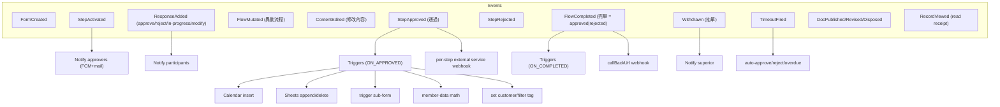
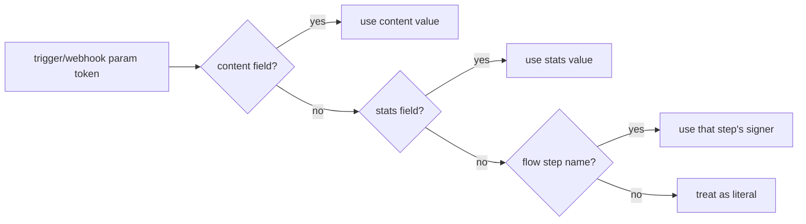
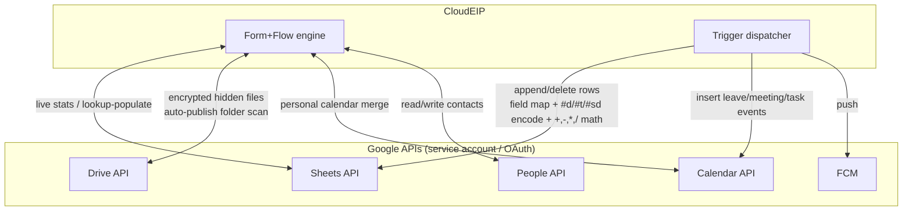
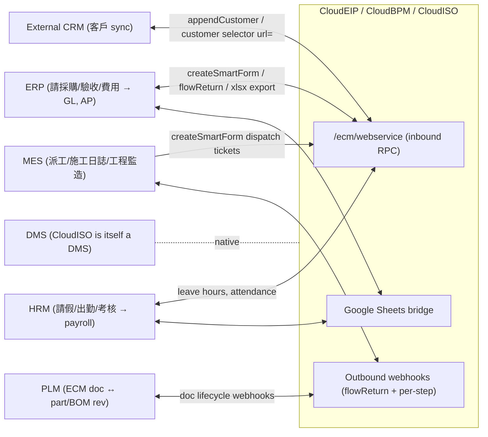
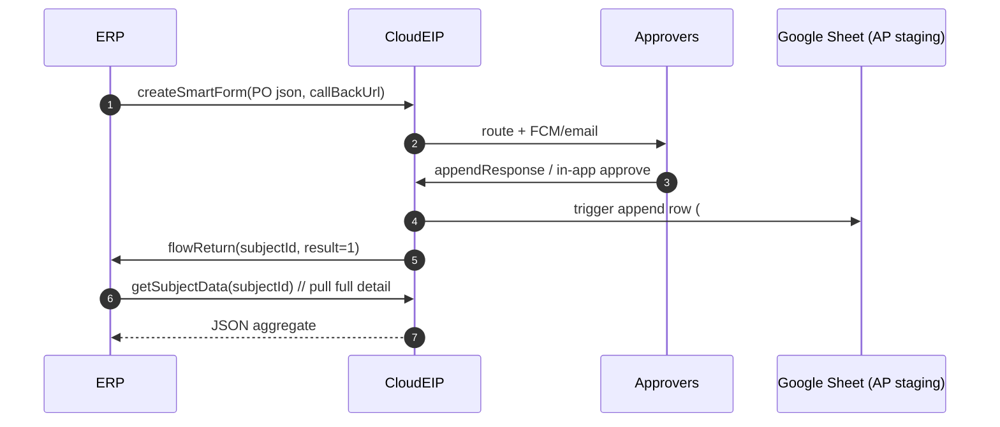
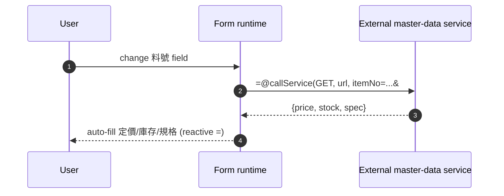
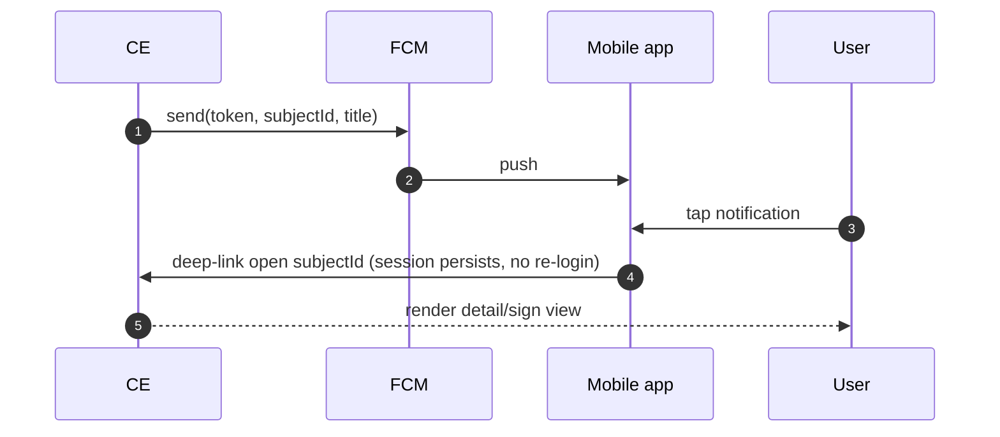

# Phase 6 — Integration Framework

CloudEIP integrates through one HTTP web service, a set of outbound webhooks,
and deep native Google Workspace connectors. This phase catalogs the API,
models the events, and draws the message flows (E‑INT‑01…07, E‑FORM‑06/07,
E‑WF‑10/11).

---

## 6.1 Integration capability inventory

| Capability | Direction | Mechanism | Evidence |
|------------|-----------|-----------|----------|
| **REST‑ish API** | inbound | `GET/POST /ecm/webservice?apiKey&function&sender&…` | E‑INT‑01 |
| **Webhook (flow completion)** | outbound | `callBackUrl` → `flowReturn(subjectId,result)` | E‑INT‑03 |
| **Webhook (per step)** | outbound | trigger "呼叫外部 service" GET/POST → `sender,subjectId,result` | E‑INT‑04 |
| **Field‑level service call** | outbound (sync) | `=@callService(GET\|POST,url,p=v,…)` in a field | M §呼叫外部Service |
| **Dynamic options** | outbound (sync) | dropdown/resource `url=` provider | E‑FORM‑06 |
| **Google Sheet (read)** | bidirectional | live stats over a sheet; lookup‑populate | E‑INT‑05, E‑FORM‑07 |
| **Google Sheet (write/delete)** | outbound | trigger append/delete rows w/ field mapping & encoding | E‑WF‑10 |
| **Google Drive** | bidirectional | encrypted attachment store; auto‑publish folder scan | E‑FILE‑01, W §文件自動上架 |
| **Firebase (FCM)** | outbound | push to bound devices | E‑NOTIF‑01 |
| **Google Calendar** | bidirectional | trigger inserts events; personal calendar merge | E‑AUTH‑03, E‑WF‑10 |
| **Google People/Contacts** | bidirectional | read/write contacts on Google login | E‑AUTH‑03 |
| **Email** | outbound | BPM notifications via Mail API/SMTP | E‑NOTIF‑04 |
| **Sub‑form orchestration** | internal | 母單觸發子單 / trigger new form | E‑WF‑10 |
| **External program approval** | inbound | `appendResponse` | E‑WF‑10 |
| **ERP / HR / CRM / MES / PLM / DMS** | bidirectional | via the above API + webhooks + Sheets bridge | E‑INT‑06 |

---

## 6.2 API catalog (`/ecm/webservice`)

Common envelope: `apiKey` (tenant key, `AIza…` form), `function`, `sender`
(`name(root/dept/acct#account)`, URL‑encoded). GET for tests; POST for
payloads > 8192 chars.

| Function | Params | Returns | Purpose |
|----------|--------|---------|---------|
| `getSubjectData` | `id` | JSON aggregate | Read a full form instance (also the canonical create template) |
| `createSmartForm` | `formId`, `sender`, `json`, `callBackUrl?` | subjectId / status | Programmatic 起單 |
| `updateSmartForm` | `subjectId`, `sender`, `json`, `callBackUrl?` | status | Patch instance content |
| `appendResponse` | `sender`, `subjectId`, `decision(1/-1)`, `comment?` | status | External‑program approval |
| `appendCustomer` | `customerId`, `customerTitle` | status | Create CRM customer |
| `getXml` | `type=JDO_Member\|JDO_Resource` | XML | Dump org/resource trees |
| `testGetOptions` | `option=region\|america\|…` | options | Demo option provider |
| `showParameters` | — | echoes params | Debug helper |

> "幾乎所有功能都支援 web service，為避免困擾並未公開" (E‑INT‑02) — the public surface is a
> curated subset; the engine is fully scriptable internally. The API is
> **RPC‑over‑HTTP with a `function` selector**, not resource‑oriented REST — a
> Phase 11 modernization target (→ OpenAPI/REST or gRPC).

### Request/response shape (createSmartForm)

```mermaid
sequenceDiagram
  autonumber
  participant ERP
  participant WS as /ecm/webservice
  participant ENG as Form+Flow engine
  participant CB as callBackUrl (ERP)
  ERP->>WS: POST function=createSmartForm&formId=PO&sender=...&json=<url‑encoded>&callBackUrl=...
  WS->>ENG: validate apiKey + sender + formId; build instance
  ENG-->>WS: subjectId (e.g. PO-20260614-7)
  WS-->>ERP: 200 { subjectId }
  Note over ENG: …approval runs (Phase 3)…
  ENG->>CB: GET/POST function=flowReturn&subjectId=PO-20260614-7&result=1
```

---

## 6.3 Event model

CloudEIP's "events" are not a formal bus; they are **engine lifecycle hooks**
that fan out to triggers, notifications and webhooks. Reconstructed taxonomy:



**Trigger event distinction (E‑WF‑11):** `通過` (ON_APPROVED — fires only on
approve) vs `完畢` (ON_COMPLETED — fires on approve *or* reject). This binary is
the engine's entire event filter vocabulary; there is no rich pub/sub topic
model (Phase 11: introduce a real event backbone).

### Parameter resolution for triggers/webhooks



Outbound context tokens available to integrations (E‑INT‑07): `#accountId`,
`#accountName`, `#companyId`, `#companyName`, plus `sender/subjectId/result`.

---

## 6.4 Google Workspace connectors (the deep integration)



**Sheets as an integration bus (notable pattern).** The "append to Google Sheet"
trigger (E‑WF‑10) supports field mapping `cloudeip:sheet`, type encoders
(`#d` date, `#t` datetime, `#sd` decode‑brackets), arithmetic prefixes
(`+`,`-`,`*`,`/` apply against existing cell), and a `#uniqueId`
(`subjectId-rowN`) for idempotent upsert. In practice **Google Sheets is used as
a lightweight integration/staging table** between CloudEIP and ERP/accounting —
clever for SMBs, fragile for regulated data (Phase 11).

---

## 6.5 Enterprise integration architecture (target systems)



Integration maturity by target:

| Target | Fit | How |
|--------|-----|-----|
| **ERP** | Strong | Purchase/inspection/expense forms → `flowReturn` + xlsx export; Sheets bridge |
| **HRM** | Strong | Leave/attendance triggers update member data; export to payroll |
| **CRM** | Medium | `appendCustomer`, customer‑selector external URL/Sheet; no 2‑way pipeline sync |
| **MES** | Medium | Dispatch/site‑log forms via API + webhooks; no real‑time shop‑floor protocol |
| **PLM** | Light | Only via generic webhooks; no part/BOM/rev semantics |
| **DMS** | Native | CloudISO *is* the DMS |

---

## 6.6 Message‑flow examples

### 6.6.1 ERP‑initiated purchase order with callback



### 6.6.2 Field self‑population from external master data



### 6.6.3 Mobile push round‑trip



---

## 6.7 Integration assessment

**Strengths:** a genuinely open API ("complete API" marketing is largely
justified — E‑INT‑06), idempotent Sheets upsert, sync field‑level service calls,
and bidirectional Workspace integration that most SMB BPM products lack.

**Weaknesses (→ Phase 11):**

1. **RPC‑style single endpoint** with a `function` switch and a shared tenant
   API key — no scopes, no OAuth client model, no rate semantics in the docs.
2. **Webhooks are fire‑and‑forget** with a thin payload (`subjectId,result`) and
   no signature/HMAC, no retry/delivery guarantees documented.
3. **Sheets‑as‑bus** puts regulated data into a consumer product with
   link‑based sharing ("anyone with the link can edit") — a data‑governance and
   Part 11 hazard.
4. **No event backbone** — only the `通過/完畢` binary; no replayable event log,
   no topics, no CDC for downstream analytics.
5. **Synchronous external calls inside form evaluation** (`=@callService`,
   `url=`) couple form responsiveness and security to third‑party uptime.
