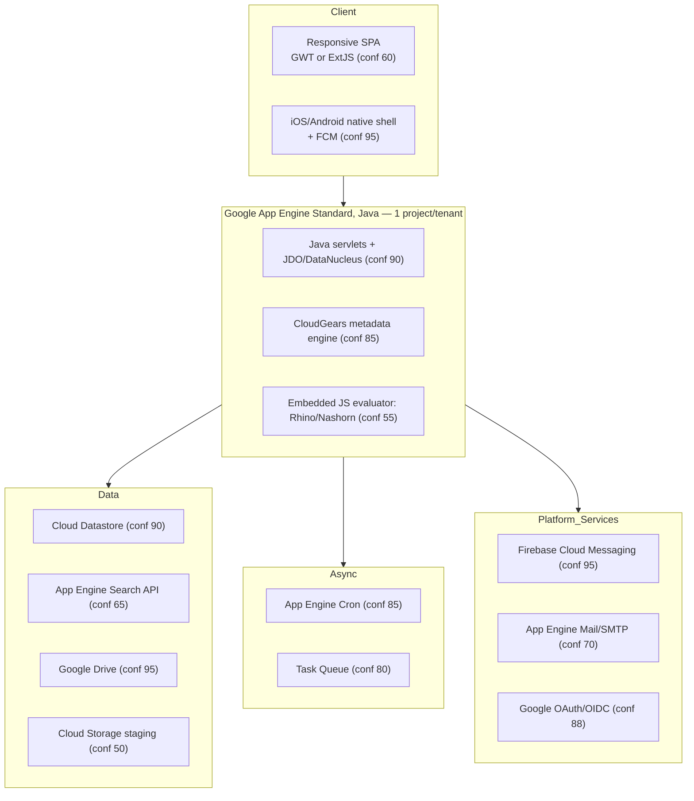

# Phase 7 — Technology Stack Estimation

A single consolidated estimate for every layer, each with **evidence**,
**confidence (0–100)** and **alternatives**. Phase 2 scored the candidate
*frameworks*; this phase commits to the most‑likely concrete stack and adds the
layers Phase 2 didn't (cloud, queue, monitoring, security tooling).

---

## 7.1 Stack‑at‑a‑glance

---

## 7.2 Layer‑by‑layer estimation

### Frontend
- **Estimate:** Metadata‑driven widget‑toolkit SPA — **GWT** (slightly favoured) or **ExtJS/Sencha**, single responsive bundle, per‑user theming.
- **Evidence:** E‑FE‑01 (SPA), E‑FE‑02 (RWD), E‑FE‑03 (tree/grid/window UI), E‑FE‑07 (skins); Java backend makes GWT idiomatic (E‑BACKEND‑01).
- **Confidence:** 80 it's GWT/ExtJS‑class; **60** which one.
- **Alternatives:** Angular (30), Vue/React (12) — no SPA‑framework‑specific tells.

### Backend
- **Estimate:** **Java on App Engine Standard (gen‑1), servlet‑based, JDO/DataNucleus**, code‑generated by the CloudGears metadata engine.
- **Evidence:** `JDO_*` kinds (E‑BACKEND‑01), epoch‑millis (E‑BACKEND‑02), Java regex (E‑BACKEND‑03), `/ecm/webservice` (E‑BACKEND‑05), CloudGears XML (E‑BACKEND‑06).
- **Confidence:** **93** Java; 70 servlet/JDO specifically.
- **Alternatives:** Spring Boot (35 — less likely on gen‑1), Python GAE (12), .NET/Node (≤6).

### Database
- **Estimate:** **Google Cloud Datastore** (Firestore in Datastore mode) via JDO; one namespace per tenant; AES‑256 JSON blobs.
- **Evidence:** E‑DB‑01 (JDO kinds), E‑DB‑02 (zero‑migration form evolution), E‑DB‑03 (JSON aggregate), E‑DB‑04/05 (AES‑256), E‑DB‑06 (path keys).
- **Confidence:** **90**.
- **Alternatives:** Firestore native (30), Cloud SQL/MySQL (10), Postgres (8).

### Cloud
- **Estimate:** **Google Cloud Platform — App Engine Standard**, automatic scaling (≤20 instances), scale‑to‑zero, multi‑region managed replication; **single‑tenant project per customer**; custom‑domain mapping for China.
- **Evidence:** E‑CLOUD‑01..10 (appspot.com, 15‑min idle shutdown + 5–10 s cold start, dynamic LB, sandbox isolation, multi‑DC replication, CN domain block).
- **Confidence:** **95**.
- **Alternatives:** GKE/Cloud Run (15 — cold‑start + appspot signature argue App Engine specifically); other clouds (≤3).

### Storage
- **Estimate:** **Google Drive** as user blob store (encrypted, hidden via service account) + **Cloud Storage** as image/PDF processing tier; per‑file 7.5 MB cap; client‑side 3rd‑party drive pickers.
- **Evidence:** E‑FILE‑01..06.
- **Confidence:** **95** Drive; 50 GCS staging.
- **Alternatives:** all‑GCS (45), S3‑compatible (3).

### Search
- **Estimate:** **App Engine Search API** with document **content extraction** for CloudISO; faceted (text + tags + type).
- **Evidence:** E‑SEARCH‑01..04.
- **Confidence:** **65** (weakest layer).
- **Alternatives:** ElasticSearch (22), embedded Lucene (18 — impractical on gen‑1), Solr (10).

### Notification
- **Estimate:** **Firebase Cloud Messaging** for push (token‑bound per account) + **App Engine Mail/SMTP** for BPM email + scheduled **daily digest** job.
- **Evidence:** E‑NOTIF‑01..05, E‑AUTH‑04.
- **Confidence:** **95** FCM; 70 mail transport (could be SendGrid).
- **Alternatives:** SendGrid/Mailgun for email (40); APNs direct (low — FCM bridges iOS).

### Queue / async
- **Estimate:** **App Engine Cron** (30‑min timeout sweep 08:00–23:30; nightly purge; retention scan) + **Task Queue** (async flow dispatch).
- **Evidence:** E‑ASYNC‑01..04.
- **Confidence:** **85** cron; **80** task queue.
- **Alternatives:** Cloud Tasks/Scheduler (modern equivalents, 60); Pub/Sub (25 — no evidence of a real bus).

### Monitoring
- **Estimate:** **Google Cloud's built‑in operations suite** (formerly Stackdriver) — logging/monitoring/error reporting come "for free" with App Engine and match the "we manage everything" pitch.
- **Evidence:** Indirect — E‑CLOUD‑05 (managed servers), E‑CLOUD‑06 (uptime SLA tracking), no third‑party APM named.
- **Confidence:** **55** (inference, not stated).
- **Alternatives:** any external APM (low — nothing named).

### Security
- **Estimate:** TLS in transit; **AES‑256 application‑layer** encryption for form bodies + credentials; **OWASP ZAP** DAST in SDLC; secure‑context gating (GPS only on https); CloudISO policy viewer (watermark/GPS/IP/time lock); digital‑signature evidence bundle.
- **Evidence:** E‑SEC‑01..06, E‑DB‑04/05, E‑FILE‑02.
- **Confidence:** **85** for the controls as described.
- **Alternatives:** KMS‑managed keys vs app‑held keys (unknown — the "even Admin can't decrypt" claim suggests **app‑held/per‑tenant keys**, conf 50).

---

## 7.3 Consolidated confidence table

| Layer | Most‑likely | Confidence | Strongest evidence | Top alternative |
|-------|-------------|-----------:|--------------------|-----------------|
| Cloud | GCP App Engine Standard | 95 | appspot + scale‑to‑zero (E‑CLOUD‑02/03) | GKE/Cloud Run (15) |
| Storage (blob) | Google Drive | 95 | named repeatedly (E‑FILE‑01/02) | all‑GCS (45) |
| Notification (push) | Firebase FCM | 95 | named (E‑NOTIF‑01) | — |
| Backend lang | Java | 93 | JDO + Java epoch/regex | Spring Boot variant (35) |
| Database | Cloud Datastore (JDO) | 90 | JDO_* kinds (E‑DB‑01) | Firestore native (30) |
| Auth | Google OAuth + local | 88/80 | OAuth popup (E‑AUTH‑01) | JWT sessions (55) |
| Metadata engine | CloudGears (proprietary) | 85 | named (E‑BACKEND‑06) | — |
| Cron | App Engine Cron | 85 | 30‑min sweep (E‑ASYNC‑02) | Cloud Scheduler (60) |
| Security controls | TLS+AES256+ZAP | 85 | (E‑SEC‑*) | KMS keys (50) |
| Frontend family | GWT / ExtJS | 80 | grid/tree SPA (E‑FE‑03) | Angular (30) |
| Task queue | App Engine Task Queue | 80 | async dispatch (E‑ASYNC‑01) | Cloud Tasks (60) |
| Email | App Engine Mail/SMTP | 70 | BPM mail (E‑NOTIF‑04) | SendGrid (40) |
| Search | App Engine Search API | 65 | full‑text all‑fields (E‑SEARCH‑01) | ElasticSearch (22) |
| Frontend exact framework | GWT | 60 | Java synergy | ExtJS (55) |
| JS evaluator | Rhino/Nashorn | 55 | `=`→JS (E‑BACKEND‑04) | client‑side JS (45) |
| Monitoring | Cloud Ops suite | 55 | managed pitch | external APM (low) |
| GCS staging | Cloud Storage | 50 | image/PDF processing | Drive‑only (45) |

---

## 7.4 The "era" hypothesis (why this stack hangs together)

Every signal points to a system **architected ~2012–2017 on App Engine
Standard gen‑1** and steadily extended:

- gen‑1 App Engine forbade raw threads/sockets/filesystem → explains JDO over
  Datastore, no embedded Lucene, Drive (not local FS) for files, cron+task‑queue
  for async, and the 15‑min idle shutdown.
- JDO/DataNucleus + GWT was *the* Google‑blessed Java web stack of that era.
- Firebase (acquired by Google 2014) slots in naturally for push.
- The `version: "2020a"` form schema marker (E‑FORM‑08) shows active maintenance
  into 2020+, but on the original foundations.

This dating matters for Phases 8–11: the constraints that shaped the elegant
parts (zero‑migration forms, single‑tenant isolation) are **gen‑1 App Engine
constraints**, and several Phase 11 weaknesses are simply "gen‑1 assumptions
meeting 2026 regulated‑industry requirements."

> **Net:** I'd stake **>90% confidence on "GCP App Engine (Java) + Datastore +
> Drive + FCM, single‑tenant, CloudGears‑generated"** as the platform's
> backbone, with the frontend framework and search backend the only genuinely
> open questions.
