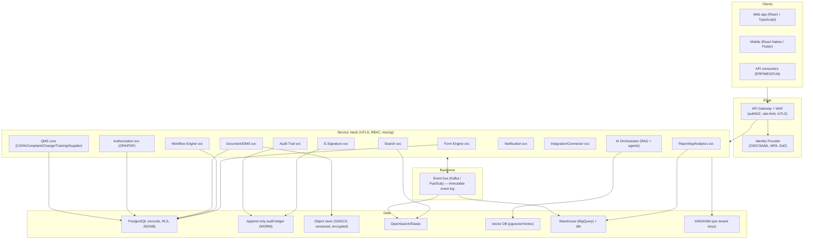
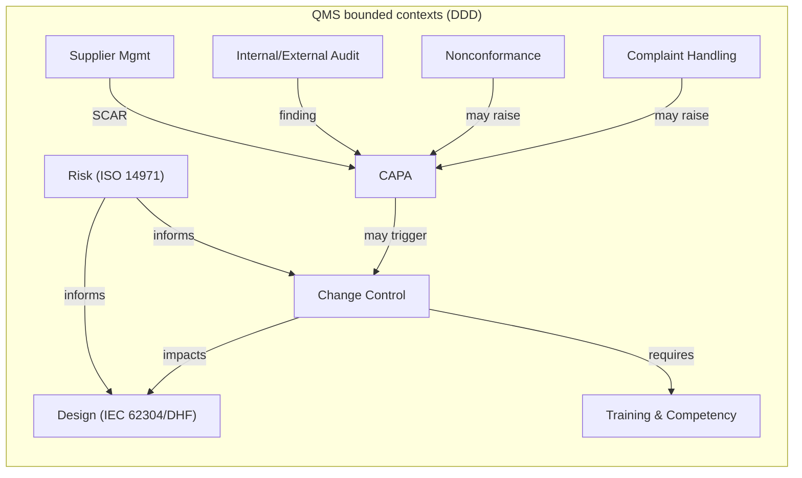
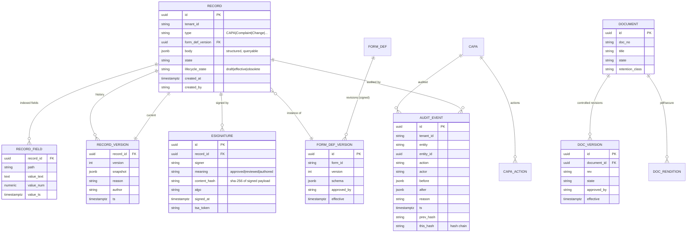
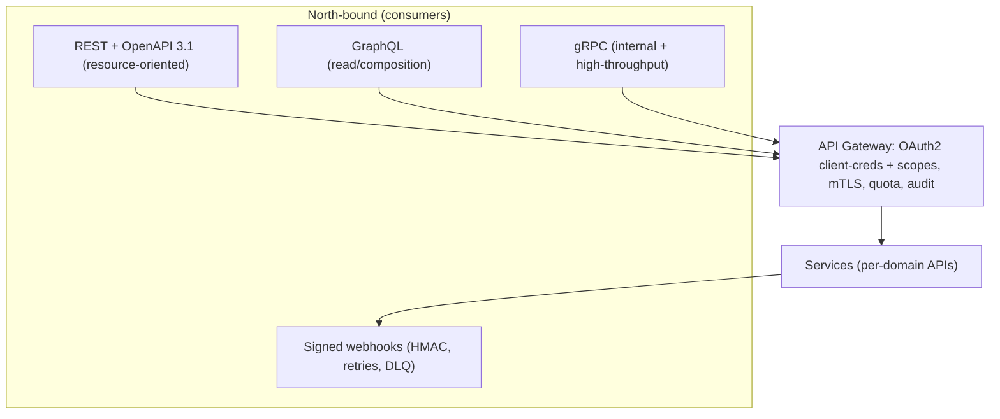
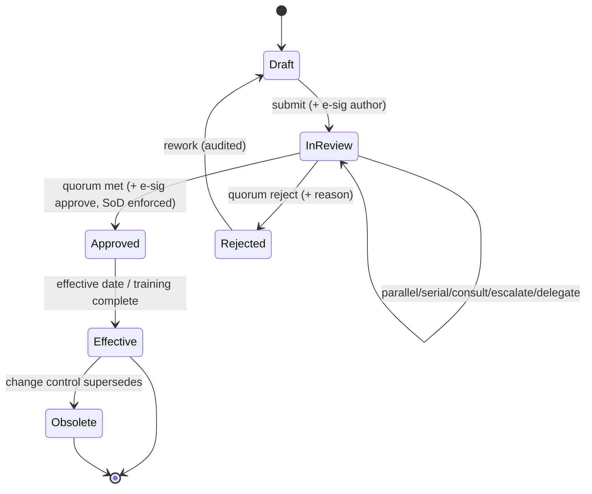
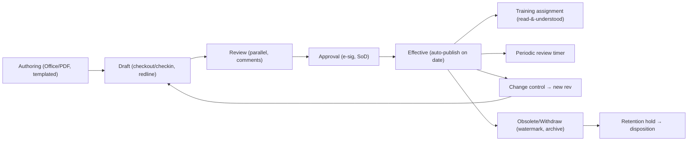
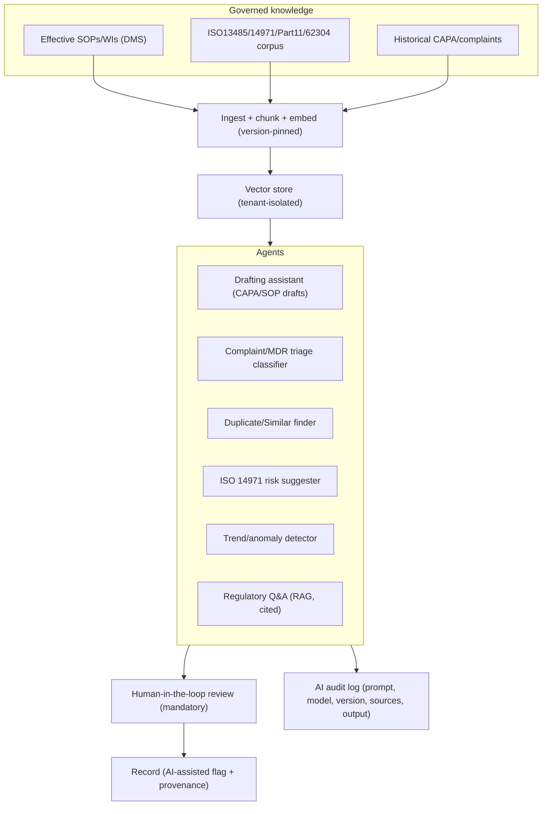
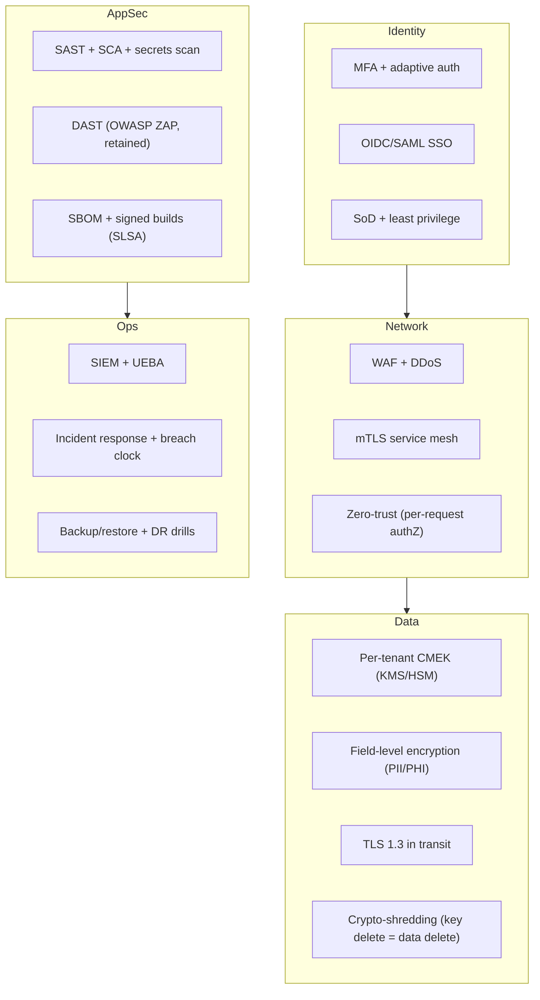
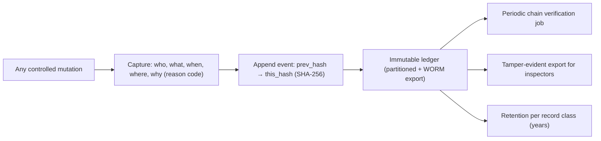

# Phase 8 — CloudEIP NextGen: Designing the Next‑Generation Platform

**Mandate:** rebuild CloudEIP as **CloudEIP NextGen**, a validated eQMS/eDMS for
medical‑device manufacturers, conformant with **ISO 13485:2016**, **FDA 21 CFR
Part 11**, **IEC 62304**, **ISO 14971**, and shipping native **QMS / DMS / CAPA
/ Complaint / Change Control / Training / Supplier Management** modules.

Design principle: **keep what made CloudEIP great** (dynamic forms, rich
workflow, mobile, Google‑grade ops) and **fix what blocks regulation** (opaque
NoSQL records, biometric‑only signatures, category‑only permissions, no event
backbone, consumer‑Sheets coupling — Phases 3–7, 11).

---

## 8.1 Design tenets

1. **Records are first‑class, queryable, immutable‑by‑append.** Replace opaque
   AES blobs with structured records + an append‑only, hash‑chained audit log.
2. **Compliance is built‑in, not bolted‑on.** Part 11 e‑sig, ALCOA+ audit,
   validated‑state controls are platform services, not per‑form effort.
3. **Single‑tenant *logical* isolation, multi‑tenant *operational* efficiency.**
   Namespaced data + per‑tenant keys, but one fleet to validate/patch.
4. **Everything is an event.** A real event backbone enables audit, analytics,
   AI and integration without point‑to‑point coupling.
5. **AI is assistive and governed.** Human‑in‑the‑loop, fully logged, never the
   approver of record.
6. **CSV/CSA‑ready.** The platform itself is built to be *computer‑system
   validated*: versioned, traceable, testable, with documented intended use.

---

## 8.2 Target architecture (logical)



---

## 8.3 Microservice architecture

| Service | Responsibility | Data store | Sync/Async |
|---------|----------------|-----------|------------|
| **Identity & Access (IAM)** | OIDC/SAML, MFA, session, SoD, password policy (Part 11 §11.300) | Postgres + IdP | sync |
| **Authorization (PDP)** | Policy decisions (OPA/Rego): RBAC+ABAC+ReBAC, field/record/doc level | Postgres (policy) | sync |
| **Form Engine** | Definition registry (versioned, signed), runtime, validation, formula sandbox | Postgres (JSONB + columns) | sync + events |
| **Workflow Engine** | BPMN‑style flows, quorum, escalation, delegation, sub‑process | Postgres + Temporal/Camunda | async |
| **E‑Signature** | Part 11 compliant signing: manifest (content hash + meaning + signer + time) | Audit ledger + KMS | sync |
| **Audit Trail** | ALCOA+ append‑only, hash‑chained, reason‑for‑change, immutable | WORM ledger | async (also sync write‑through) |
| **Document/DMS** | Lifecycle (draft→review→approve→effective→obsolete), rendition, controlled viewer, retention | Object store + Postgres | sync + events |
| **QMS Core** | CAPA, Complaint, Change Control, Training, Supplier, NCR, Audit mgmt | Postgres | sync + events |
| **Search** | Full‑text + content extraction + faceting; permission‑filtered | OpenSearch | async index |
| **Notification** | Push (FCM/APNs), email, in‑app, digests, escalation alerts | queue | async |
| **Integration/Connector** | REST/gRPC, signed webhooks, ERP/MES/PLM adapters, Sheets→governed connector | — | async |
| **AI Orchestrator** | RAG over controlled docs, drafting assistants, classification, anomaly detection — all logged | Vector DB | async/sync |
| **Reporting/Analytics** | Dashboards, KPIs, pivot, regulatory metrics | Warehouse | async |
| **Tenant/Config** | Tenant lifecycle, keys, feature flags, validated‑version pinning | Postgres | sync |



---

## 8.4 Database architecture

A **polyglot, compliance‑first** model. The central change vs CloudEIP:
**records become hybrid relational+JSONB**, not opaque blobs, and **audit is a
separate immutable ledger**.



Storage choices and rationale:

| Concern | Store | Why |
|---------|-------|-----|
| Records (CAPA, etc.) | **PostgreSQL** w/ JSONB + projected columns + **Row‑Level Security** | keeps dynamic‑form flexibility *and* relational query/reporting/field‑level authZ |
| Audit log | **Append‑only ledger** (Postgres partitioned + WORM bucket export, or QLDB/immudb) | ALCOA+, tamper‑evident hash chain |
| Documents/blobs | **Object store** (GCS/S3) **versioned + CMEK** | retention, immutability, rendition |
| Search | **OpenSearch** | content extraction, faceting, permission‑filtered |
| Analytics | **BigQuery + dbt** | regulatory KPIs without touching OLTP |
| Vectors | **pgvector / Vertex** | RAG over controlled docs |
| Keys | **KMS/HSM**, per‑tenant CMEK | crypto‑shred, key isolation |

**Dynamic forms without opacity:** the form body stays JSONB (flexibility,
zero‑migration), but `RECORD_FIELD` projects searchable/auditable fields into
typed columns, and `FORM_DEF_VERSION` is an immutable, **signed** schema
revision — solving CloudEIP's "which revision produced this record?" gap (Phase
4.7) while keeping its best feature.

---

## 8.5 API architecture



- **REST + OpenAPI 3.1** replaces the `function=`‑switch RPC (Phase 6.2). Every
  resource (`/capa`, `/documents`, `/records`, `/signatures`) is versioned.
- **Scoped OAuth2** per integration client (vs one shared tenant `AIza…` key).
- **Webhooks are signed (HMAC), retried, dead‑lettered**, with delivery receipts
  (fixes Phase 6.7).
- **All write APIs require a signing/audit context** (actor, reason) — the API
  cannot mutate a controlled record without an audit event.

---

## 8.6 Workflow architecture

Adopt a **durable workflow engine** (Temporal, or Camunda 8/BPMN) wrapping the
reconstructed CloudEIP semantics (Phase 3) and adding regulated controls.



Carries forward (from Phase 3): sequential/parallel/any/all/majority/¾ quorums,
skip conditions, timeout→auto‑approve/reject/escalate, reject‑to‑any‑step,
runtime flow mutation (now itself e‑signed + reason‑coded), delegation.

Adds for compliance: **segregation of duties** (author ≠ approver), **four‑eyes
gates**, **e‑signature binding per transition**, **deadline SLAs with regulatory
clocks** (e.g. complaint → decision timelines, MDR/vigilance windows), and a
**fully replayable history** from the event log.

---

## 8.7 Document architecture (DMS, ISO 13485 §4.2 / Part 11)



Improvements over CloudISO (Phases 1, 4.8): controlled rendition pipeline
(no consumer‑Sheets templating for controlled output), **read‑and‑understood**
training tie‑in, periodic‑review automation, **immutable rev history with signed
manifests**, retention/legal‑hold, and a hardened secure viewer (keeps
CloudISO's watermark/GPS/IP/time controls, E‑SEC‑05, but server‑rendered with
per‑view tokens).

---

## 8.8 AI architecture (governed, assistive)



Governance rules (so AI never breaks validation/Part 11):

- **AI is never the signer/approver of record** — it drafts/suggests; a human
  signs (§11.10, §11.50).
- **Every AI interaction is logged** (prompt, model id+version, retrieved
  sources, output, the human's accept/edit) → traceable, reproducible.
- **Tenant‑isolated retrieval** — no cross‑tenant leakage; controlled docs only.
- **Model/version pinning** — part of the validated configuration; model changes
  go through change control.
- **Citations required** — RAG answers cite the effective document + revision.

---

## 8.9 Cybersecurity architecture



Keeps CloudEIP's good instincts (TLS, AES‑256, OWASP ZAP — E‑SEC‑*) and adds
**zero‑trust per‑request authorization**, **per‑tenant CMEK with
crypto‑shredding**, **SBOM/signed builds**, **SIEM/UEBA**, and a documented
**incident‑response + breach‑notification** capability (regulatory necessity).

---

## 8.10 Audit‑trail architecture (ALCOA+)



| ALCOA+ attribute | Mechanism |
|------------------|-----------|
| Attributable | Authenticated actor + e‑sig identity on every event |
| Legible | Human‑readable rendered audit + structured JSON |
| Contemporaneous | Server‑authoritative time + TSA token |
| Original | Append‑only; originals never overwritten |
| Accurate | Hash chain + before/after diffs |
| Complete | Every CRUD + view + sign + flow mutation logged |
| Consistent | Single audit service, one schema |
| Enduring | WORM + retention policy |
| Available | Inspector export + search |

This replaces CloudEIP's "logs stored in the same mutable Datastore" (Phase 3.8)
with a **tamper‑evident, hash‑chained, retained** ledger.

---

## 8.11 Electronic‑signature architecture (21 CFR Part 11 §11.50/11.70/11.200/11.300)

The biggest single upgrade. CloudEIP's signature = selfie+handwrite+GPS+time
evidence bundle (E‑SEC‑06) — good for human non‑repudiation, **not** a Part 11
signature manifest. NextGen makes signatures cryptographic and *bound to
meaning and content*.

```mermaid
sequenceDiagram
  autonumber
  participant U as Signer
  participant ESIG as E‑Signature svc
  participant IAM
  participant KMS
  participant LED as Audit ledger
  U->>ESIG: request sign(record v, meaning="Approved")
  ESIG->>IAM: re‑authenticate (2 components: id + password/MFA)  // §11.200
  IAM-->>ESIG: identity asserted
  ESIG->>ESIG: build manifest {content_hash(sha256), meaning, signer, time}
  ESIG->>KMS: sign manifest (per‑tenant key / user cert)
  KMS-->>ESIG: signature
  ESIG->>LED: append signed manifest (immutable, hash‑chained)
  ESIG-->>U: signed; manifestation shown on record (name, date/time, meaning) // §11.50
```

| Part 11 clause | NextGen control |
|----------------|-----------------|
| §11.50 signature manifestations | Printed/displayed name + date/time + **meaning** on the record & renditions |
| §11.70 signature/record linking | Manifest binds **content hash** → signature → record version (cryptographic) |
| §11.100 uniqueness | One identity per signer; no reuse/reassignment |
| §11.200 components | Two distinct components (id + password/MFA); re‑auth at signing |
| §11.300 controls | Password aging, lockout, periodic checks, loss‑management |
| Biometric (optional) | CloudEIP's selfie/handwrite retained as *additional* evidence, not the legal basis |

---

## 8.12 What is preserved vs replaced (traceability to CloudEIP)

| CloudEIP feature | NextGen disposition |
|------------------|---------------------|
| Dynamic forms / ~20 controls (Phase 4) | **Preserved**, now JSONB + projected columns + signed schema versions |
| Rich workflow (Phase 3) | **Preserved + hardened** on a durable engine with SoD/e‑sig |
| Mobile push (FCM) (Phase 2) | **Preserved** (FCM/APNs), token‑bound, validated |
| Secure doc viewer (Phase 1/5) | **Preserved + hardened**, server‑rendered, tokenized |
| Google Drive blobs (Phase 2) | **Replaced** by versioned, CMEK object store |
| Opaque AES JSON in Datastore (Phase 2/4) | **Replaced** by queryable Postgres + audit ledger |
| Biometric "digital signature" (Phase 5) | **Augmented** by Part 11 cryptographic e‑signature |
| `function=` RPC + shared API key (Phase 6) | **Replaced** by REST/OpenAPI + scoped OAuth2 + signed webhooks |
| Sheets‑as‑bus (Phase 6) | **Replaced** by governed integration connectors + event bus |
| Category‑only permissions (Phase 5) | **Extended** to field/record/doc‑level via PDP (OPA) + RLS |
| No event backbone (Phase 6) | **Added** (Kafka/Pub/Sub immutable event log) |

Phases 9–10 turn this design into a C4 model, ERD, microservice list and a
concrete, generatable project skeleton; Phase 11 enumerates the CloudEIP
weaknesses this design exists to remediate.
