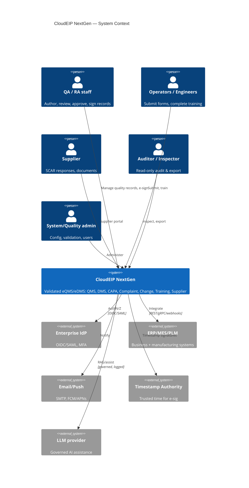
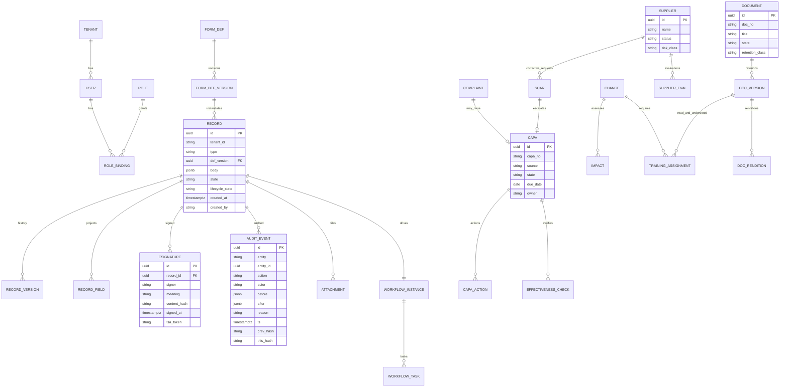
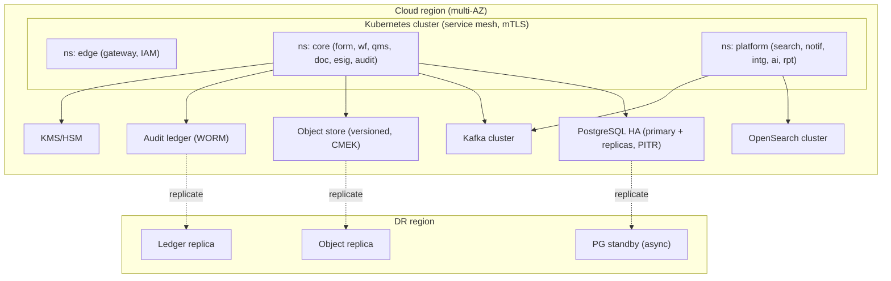
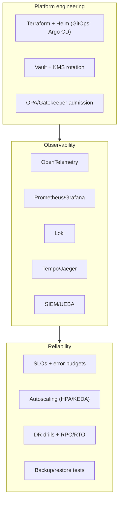

# Phase 9 — Development Blueprint (CloudEIP NextGen)

A buildable blueprint for the Phase 8 design: C4 model, ERD, API spec,
microservice list, technology stack, deployment, CI/CD and DevOps.

---

## 9.1 C4 — Level 1: System Context



## 9.2 C4 — Level 2: Container

```mermaid
C4Container
  title CloudEIP NextGen — Containers
  Person(user, "User")
  System_Boundary(neip, "CloudEIP NextGen") {
    Container(web, "Web App", "React + TS", "SPA")
    Container(mob, "Mobile App", "React Native", "Push + capture")
    Container(gw, "API Gateway", "Kong/Apigee", "OAuth2, mTLS, quota, audit")
    Container(iam, "IAM", "Keycloak", "OIDC/SAML, MFA, SoD")
    Container(pdp, "Authorization", "OPA", "RBAC+ABAC+ReBAC")
    Container(form, "Form Engine", "Java/Kotlin", "Definitions, runtime, validation")
    Container(wf, "Workflow Engine", "Temporal", "Durable flows")
    Container(qms, "QMS Core", "Java/Kotlin", "CAPA/Complaint/Change/Training/Supplier")
    Container(doc, "Document/DMS", "Go/Java", "Lifecycle, rendition, viewer")
    Container(esig, "E‑Signature", "Go", "Part 11 manifests")
    Container(audit, "Audit Trail", "Go", "Hash‑chained ledger")
    Container(search, "Search", "OpenSearch", "Full‑text + content")
    Container(notif, "Notification", "Node", "Push/email/digest")
    Container(intg, "Integration", "Java", "Connectors + webhooks")
    Container(ai, "AI Orchestrator", "Python", "RAG + agents")
    Container(rpt, "Reporting", "dbt + BI", "KPIs, dashboards")
    ContainerDb(pg, "PostgreSQL", "RLS + JSONB", "Records, config, policy")
    ContainerDb(ledger, "Audit Ledger", "WORM", "Immutable events")
    ContainerDb(obj, "Object Store", "GCS/S3", "Versioned blobs")
    ContainerDb(vec, "Vector DB", "pgvector", "Embeddings")
    ContainerQueue(bus, "Event Bus", "Kafka/Pub/Sub", "Immutable event log")
  }
  Rel(user, web, "HTTPS")
  Rel(user, mob, "HTTPS")
  Rel(web, gw, "REST/GraphQL")
  Rel(mob, gw, "REST")
  Rel(gw, iam, "verify")
  Rel(gw, form, "route"); Rel(gw, wf, "route"); Rel(gw, qms, "route"); Rel(gw, doc, "route")
  Rel(form, pdp, "authorize"); Rel(qms, pdp, "authorize"); Rel(doc, pdp, "authorize")
  Rel(form, pg, "read/write"); Rel(qms, pg, "read/write"); Rel(wf, pg, "state")
  Rel(doc, obj, "blobs"); Rel(esig, ledger, "append"); Rel(audit, ledger, "append")
  Rel(form, bus, "emit"); Rel(qms, bus, "emit"); Rel(wf, bus, "emit")
  Rel(bus, search, "index"); Rel(bus, rpt, "stream"); Rel(bus, audit, "consume")
  Rel(ai, vec, "retrieve")
```

## 9.3 C4 — Level 3: Component (QMS Core, CAPA example)

```mermaid
C4Component
  title QMS Core — CAPA components
  Container_Boundary(qms, "QMS Core") {
    Component(capaApi, "CAPA API", "REST controller", "CRUD + transitions")
    Component(capaSvc, "CAPA Service", "domain", "Investigation, root‑cause, effectiveness")
    Component(linkSvc, "Linkage", "domain", "Complaint/NCR/Audit → CAPA → Change")
    Component(ruleSvc, "Rules", "domain", "Due dates, escalation, SoD")
    Component(wfClient, "Workflow Client", "adapter", "Temporal")
    Component(esigClient, "E‑sig Client", "adapter", "sign transitions")
    Component(repo, "CAPA Repository", "persistence", "Postgres JSONB+cols")
    Component(evt, "Event Publisher", "adapter", "Kafka")
  }
  Rel(capaApi, capaSvc, "calls")
  Rel(capaSvc, linkSvc, "uses"); Rel(capaSvc, ruleSvc, "uses")
  Rel(capaSvc, wfClient, "drive flow"); Rel(capaSvc, esigClient, "require e‑sig")
  Rel(capaSvc, repo, "persist"); Rel(capaSvc, evt, "emit CAPA events")
```

---

## 9.4 Database ERD (consolidated)



---

## 9.5 API specification (representative OpenAPI excerpt)

```yaml
openapi: 3.1.0
info: { title: CloudEIP NextGen API, version: 1.0.0 }
servers: [{ url: https://api.{tenant}.cloudeip.example/v1 }]
security: [{ oauth2: [qms.write] }]
paths:
  /capa:
    post:
      summary: Create CAPA
      requestBody:
        required: true
        content: { application/json: { schema: { $ref: '#/components/schemas/CapaCreate' } } }
      responses:
        '201': { description: created, headers: { Location: { schema: { type: string } } } }
  /capa/{id}:
    get: { summary: Get CAPA, responses: { '200': { description: ok } } }
  /capa/{id}/transitions:
    post:
      summary: Transition CAPA state (requires e‑signature context)
      requestBody:
        content:
          application/json:
            schema:
              type: object
              required: [to, reason, signature]
              properties:
                to:        { type: string, enum: [InReview, Approved, Effective, Closed, Rejected] }
                reason:    { type: string }     # mandatory reason‑for‑change
                signature: { $ref: '#/components/schemas/ESignContext' }
      responses: { '200': { description: transitioned }, '409': { description: SoD/quorum violation } }
  /documents/{id}/signatures:
    post: { summary: Apply Part 11 e‑signature, responses: { '201': { description: signed } } }
components:
  securitySchemes:
    oauth2:
      type: oauth2
      flows: { clientCredentials: { tokenUrl: /oauth/token, scopes: { qms.write: write QMS, dms.read: read docs } } }
  schemas:
    ESignContext:
      type: object
      required: [meaning, reauth_token]
      properties:
        meaning:      { type: string, enum: [Authored, Reviewed, Approved] }   # §11.50
        reauth_token: { type: string }                                          # §11.200 second factor
```

API conventions: resource‑oriented, versioned (`/v1`), scoped OAuth2, mandatory
`reason` + `signature` on controlled transitions, RFC‑7807 problem+json errors,
idempotency keys on POST, cursor pagination, signed webhooks (HMAC + retry/DLQ).

---

## 9.6 Microservice list

| # | Service | Lang (suggested) | Datastore | Key deps |
|---|---------|------------------|-----------|----------|
| 1 | API Gateway | Kong/Apigee | — | IdP |
| 2 | IAM | Keycloak | Postgres | OIDC/SAML |
| 3 | Authorization (PDP) | OPA (Go) | Postgres | bundles |
| 4 | Form Engine | Kotlin/Java | Postgres | bus |
| 5 | Workflow Engine | Temporal (Go/Java SDK) | Postgres | bus, esig |
| 6 | QMS Core | Kotlin/Java | Postgres | wf, esig, bus |
| 7 | Document/DMS | Go/Java | Object store + Postgres | rendition, viewer |
| 8 | E‑Signature | Go | Ledger + KMS | IAM, TSA |
| 9 | Audit Trail | Go | WORM ledger | bus |
| 10 | Search | OpenSearch + indexer (Java) | OpenSearch | bus |
| 11 | Notification | Node/TS | queue | FCM/APNs/SMTP |
| 12 | Integration/Connector | Java | Postgres | bus, webhooks |
| 13 | AI Orchestrator | Python (FastAPI) | Vector DB | LLM, DMS |
| 14 | Reporting/Analytics | dbt + BI | Warehouse | bus |
| 15 | Tenant/Config | Kotlin/Java | Postgres | KMS |

---

## 9.7 Technology stack

| Concern | Choice |
|---------|--------|
| Web | React 18 + TypeScript, Vite, TanStack Query, form renderer (JSON‑schema driven) |
| Mobile | React Native (or Flutter), FCM/APNs |
| Backend | JVM (Kotlin/Java) for domain svcs; Go for crypto/ledger/gateway‑adjacent; Python for AI |
| Workflow | Temporal (or Camunda 8 / Zeebe BPMN) |
| Data | PostgreSQL 16 (RLS, JSONB, partitioning), pgvector |
| Audit ledger | Postgres partitioned + WORM export (immudb/QLDB optional) |
| Object store | GCS or S3, versioned + CMEK |
| Search | OpenSearch/Elasticsearch + Tika content extraction |
| Event bus | Kafka (or Pub/Sub) |
| Warehouse | BigQuery/Snowflake + dbt |
| Identity | Keycloak (OIDC/SAML), MFA |
| Policy | OPA/Rego |
| Secrets/keys | Vault + KMS/HSM, per‑tenant CMEK |
| Containers | Docker, Kubernetes (GKE/EKS), Istio/Linkerd mesh |
| IaC | Terraform + Helm |
| Observability | OpenTelemetry → Prometheus/Grafana/Loki/Tempo; SIEM |

---

## 9.8 Deployment diagram



Tenancy: **pooled multi‑tenant with hard isolation** — shared cluster, but
Postgres RLS by `tenant_id`, per‑tenant CMEK, per‑tenant search indices and
vector namespaces. (Optional **silo** deployment per tenant for the highest
‑assurance customers, mirroring CloudEIP's single‑tenant heritage.)

---

## 9.9 CI/CD pipeline (validation‑aware / GAMP 5)

```mermaid
flowchart LR
  PR["PR + linked requirement/risk ID"] --> CI
  subgraph CI["CI (per commit)"]
    LINT["Lint + format"] --> UT["Unit tests"] --> SAST["SAST + SCA + secrets"] --> BUILD["Build + SBOM + sign (SLSA)"]
  end
  BUILD --> IT["Integration + contract tests"]
  IT --> DAST["DAST (ZAP) + IaC scan"]
  DAST --> STG["Deploy to Validation/Staging"]
  STG --> OQ["Automated OQ/PQ test suite + traceability report"]
  OQ --> APPROVE["Quality e‑sign release (change control)"]
  APPROVE --> PROD["Progressive prod deploy (canary/blue‑green)"]
  PROD --> MON["Observability + audit verification"]
```



Validation hooks (what makes it CSV/CSA‑ready):

- **Traceability:** every change links requirement → risk → test → release
  record; pipeline emits a **traceability matrix** artifact.
- **Versioned validated state:** released versions are immutable, signed, and
  **pinned per tenant**; upgrades go through documented change control.
- **Automated OQ/PQ:** the regulated test suite runs in the pipeline; results
  are retained as validation evidence.
- **Release e‑signature:** production promotion requires a Part‑11 e‑signed
  approval (the pipeline itself respects the audit model).

---

## 9.10 DevOps / SRE architecture



SLO targets (illustrative): API p99 < 300 ms; availability 99.9%+; RPO ≤ 5 min
(PITR), RTO ≤ 1 h; audit‑chain verification job hourly; quarterly DR drills.
GitOps + OPA admission make the *deployed* state continuously match the
*validated* state — directly addressing the fleet‑drift risk of CloudEIP's
per‑tenant manual deploys (Phase 11).
