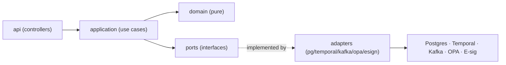
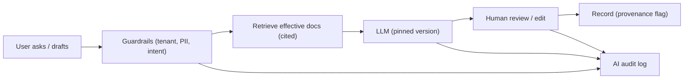

# Phase 10 — Claude Code Project Generation

A concrete, generatable scaffold for **CloudEIP NextGen**, plus a prompt library
to drive Claude Code through building it module by module. The structure
realises the Phase 8/9 design.

---

## 10.1 Monorepo top‑level structure

```text
cloudeip-nextgen/
├── README.md
├── CLAUDE.md                      # repo conventions for Claude Code (see 10.11)
├── docs/
│   ├── architecture/             # C4, ADRs, threat model
│   ├── compliance/               # CSV plan, traceability matrix, Part 11 mapping
│   └── api/                      # OpenAPI specs (source of truth)
├── infra/
│   ├── terraform/                # cloud resources (per env)
│   ├── helm/                     # service charts
│   └── argocd/                   # GitOps app-of-apps
├── platform/
│   ├── gateway/                  # API gateway config
│   ├── iam/                      # Keycloak realm-as-code
│   └── policy/                   # OPA bundles (Rego)
├── services/
│   ├── form-engine/
│   ├── workflow-engine/
│   ├── qms-core/
│   ├── document-dms/
│   ├── e-signature/
│   ├── audit-trail/
│   ├── search/
│   ├── notification/
│   ├── integration/
│   ├── ai-orchestrator/
│   └── reporting/
├── web/                          # React + TS SPA
├── mobile/                       # React Native
├── libs/                         # shared: events schema, dto, auth client, audit client
│   ├── events/                   # Avro/Protobuf event contracts
│   ├── common-domain/
│   └── test-fixtures/
├── db/
│   ├── migrations/               # Flyway/Liquibase per service
│   └── seeds/
├── tests/
│   ├── contract/                 # Pact
│   ├── e2e/                      # Playwright
│   └── oq-pq/                    # validation test suite
└── .github/workflows/            # CI/CD (validation-aware)
```

Principle: **one deployable per `services/*`**, shared contracts in `libs/`,
**OpenAPI and event schemas are the source of truth** and code is generated from
them.

---

## 10.2 Backend service structure (hexagonal / ports‑and‑adapters)

Example: `services/qms-core/` (Kotlin + Spring/Quarkus). Every domain service
follows the same shape so Claude Code can generate them uniformly.

```text
services/qms-core/
├── build.gradle.kts
├── src/main/kotlin/com/cloudeip/qms/
│   ├── api/                      # REST controllers (generated from OpenAPI)
│   │   ├── CapaController.kt
│   │   ├── ComplaintController.kt
│   │   └── ChangeController.kt
│   ├── domain/                   # pure domain: entities, value objects, policies
│   │   ├── capa/{Capa.kt,CapaState.kt,RootCause.kt,Effectiveness.kt}
│   │   ├── complaint/
│   │   ├── change/
│   │   └── shared/{ReasonForChange.kt,Quorum.kt,SoD.kt}
│   ├── application/              # use cases / services (orchestrate domain)
│   │   ├── CapaService.kt
│   │   └── ports/{Repository.kt,WorkflowPort.kt,ESignPort.kt,EventPort.kt,AuthzPort.kt}
│   ├── adapters/                 # infra implementations of ports
│   │   ├── persistence/{CapaRepositoryPg.kt,RecordFieldProjector.kt}
│   │   ├── workflow/TemporalAdapter.kt
│   │   ├── esign/ESignClient.kt
│   │   ├── events/KafkaPublisher.kt
│   │   └── authz/OpaClient.kt
│   └── config/
├── src/test/kotlin/             # unit + integration (Testcontainers)
└── src/main/resources/
    ├── openapi/qms.yaml          # contract
    └── db/migration/             # Flyway V1__*.sql
```



---

## 10.3 Frontend structure (React + TS, JSON‑schema‑driven forms)

```text
web/
├── src/
│   ├── app/                      # routing, providers
│   ├── features/
│   │   ├── capa/{api.ts,CapaList.tsx,CapaDetail.tsx,CapaTransition.tsx}
│   │   ├── complaint/  ├── change/  ├── training/  ├── supplier/
│   │   ├── documents/{DocViewer.tsx,SecureRenderer.tsx}
│   │   └── esign/{SignDialog.tsx,ReauthForm.tsx}
│   ├── form-renderer/            # the dynamic form engine UI
│   │   ├── FormRenderer.tsx      # interprets FormDefVersion JSON
│   │   ├── controls/             # ~20 controls (mirrors CloudEIP catalogue)
│   │   ├── expressions/          # safe formula evaluator (no eval)
│   │   └── validation/           # JSON-schema + rule engine
│   ├── lib/{authClient.ts,auditClient.ts,apiClient.ts}
│   └── components/               # design system
├── tests/                        # Vitest + Playwright
└── package.json
```

The `form-renderer/` is the modern reimplementation of CloudGears' interpretive
renderer (Phase 4.6) — it consumes a `FormDefVersion` JSON and renders
input/summary/detail states responsively, with a **sandboxed** expression
evaluator (replacing CloudEIP's raw‑JS `=` evaluator — Phase 11 risk).

---

## 10.4 Database migration structure

```text
db/migrations/
├── qms-core/
│   ├── V1__records.sql           # record, record_version, record_field
│   ├── V2__capa.sql
│   ├── V3__rls_policies.sql      # ROW LEVEL SECURITY by tenant_id
│   └── V4__projections.sql       # generated columns / trigger projections
├── document-dms/
├── e-signature/
└── audit-trail/
    └── V1__ledger.sql            # append-only, hash-chain columns, no UPDATE/DELETE grant
```

Conventions: **forward‑only** migrations (Flyway), every table has `tenant_id`
+ RLS, audit/ledger tables grant **INSERT/SELECT only** (no UPDATE/DELETE) at
the DB role level, projections keep JSONB queryable.

---

## 10.5 API structure (contract‑first)

```text
docs/api/
├── qms.yaml          # OpenAPI 3.1 (CAPA, Complaint, Change, Training, Supplier)
├── dms.yaml          # documents, versions, renditions, viewer tokens
├── esign.yaml        # signatures, reauth
├── workflow.yaml     # tasks, transitions, delegation
├── form.yaml         # definitions, versions, instances
└── webhooks.yaml     # AsyncAPI: emitted events + delivery contract
libs/events/
├── capa.events.avsc  # CapaCreated, CapaTransitioned, CapaClosed
├── doc.events.avsc   # DocPublished, DocObsoleted
└── audit.events.avsc # AuditAppended
```

Codegen: server stubs + TS client + event types are generated from these specs
in CI — drift between docs and code is a build failure.

---

## 10.6 Workflow engine structure

```text
services/workflow-engine/
├── workflows/                    # Temporal workflow definitions
│   ├── ApprovalWorkflow.kt       # sequential/parallel/quorum (Phase 3 semantics)
│   ├── EscalationActivities.kt   # timeout → auto-approve/reject/escalate
│   └── DelegationActivities.kt
├── model/{StepDef.kt,Quorum.kt,SkipRule.kt,TimeoutSpec.kt}
├── eval/                         # routing DSL evaluator (typed, sandboxed)
│   └── SkipExpressionEvaluator.kt   # reimplements CloudEIP 滑步 grammar safely
└── api/WorkflowController.kt
```

Carries the reconstructed CloudEIP routing grammar (Phase 3.4) into a **typed,
sandboxed evaluator** — same expressiveness (`in/!in`, ternary, `@role`,
`@applicant`), no arbitrary code execution.

---

## 10.7 Form engine structure

```text
services/form-engine/
├── definition/{FormDef.kt,FormDefVersion.kt,FieldDef.kt,ControlType.kt}
├── registry/                     # versioned, signed definitions
├── runtime/
│   ├── FormRuntime.kt
│   ├── ExpressionEngine.kt       # @-once + =reactive, SANDBOXED (GraalJS isolate)
│   └── Validator.kt              # blank/regex/email/vatNo/nationalId/comparators
├── connectors/                   # external option/lookup providers (governed)
│   ├── HttpOptionProvider.kt
│   └── SheetLookupProvider.kt    # governed replacement for Sheets coupling
└── api/FormController.kt
```

---

## 10.8 Document engine structure

```text
services/document-dms/
├── lifecycle/{DocLifecycle.kt}   # draft→review→approve→effective→obsolete
├── rendition/                    # controlled PDF/secure rendering (no consumer Sheets)
│   └── RenditionService.kt       # headless office/PDF, watermark, manifest stamp
├── viewer/                       # secure viewer: tokens, GPS/IP/time policy, watermark
│   └── ViewerTokenService.kt
├── retention/RetentionScheduler.kt
└── api/{DocumentController.kt,ViewerController.kt}
```

Keeps CloudISO's strengths (lifecycle, secure viewer with GPS/IP/time locks,
auto‑publish) but renders controlled output **in‑house**, not via shared Google
Sheets (Phase 11 fix).

---

## 10.9 AI agent structure

```text
services/ai-orchestrator/
├── app/main.py                   # FastAPI
├── rag/
│   ├── ingest.py                 # version-pinned chunk+embed of EFFECTIVE docs
│   ├── retriever.py              # tenant-isolated retrieval
│   └── store.py                  # pgvector
├── agents/
│   ├── capa_drafter.py           # drafts investigation/RCA (human signs)
│   ├── complaint_triage.py       # MDR/vigilance classification suggestion
│   ├── dup_finder.py             # similar complaints/CAPAs
│   ├── risk_suggester.py         # ISO 14971 hazard/harm suggestions
│   └── reg_qa.py                 # cited RAG Q&A over controlled corpus
├── governance/
│   ├── audit_logger.py           # logs prompt, model+version, sources, output, human action
│   ├── guardrails.py             # PII, jailbreak, tenant isolation, no-auto-approve
│   └── model_registry.py         # pinned models (change-controlled)
└── tests/
```



---

## 10.10 Prompt library (for driving Claude Code)

Stored as `docs/prompts/` and reusable as Claude Code slash‑style tasks. Each is
written to produce **tested, traceable** output.

### 10.10.1 Scaffolding prompts

| Prompt | Intent |
|--------|--------|
| `scaffold-service` | "Create a new hexagonal service `<name>` matching `services/qms-core` layout: api/domain/application/adapters/config, Flyway migrations, Testcontainers IT, OpenAPI stub, Dockerfile, Helm chart. Wire OPA authz, Kafka publisher, audit client." |
| `add-aggregate` | "Add domain aggregate `<Name>` with states `<...>`, RLS table + projections, REST resource from `docs/api/<spec>.yaml`, events in `libs/events`, unit+contract tests." |
| `gen-from-openapi` | "Regenerate controllers + TS client + event types from `docs/api/*.yaml` and fail if drift." |

### 10.10.2 Compliance prompts

| Prompt | Intent |
|--------|--------|
| `part11-esign` | "Implement an e‑signature transition for `<resource>`: require re‑auth (second component), build manifest {content_hash, meaning, signer, time, tsa_token}, append to audit ledger, render §11.50 manifestation. Add tests for SoD + uniqueness." |
| `alcoa-audit` | "Ensure every mutating endpoint on `<service>` emits a hash‑chained `AUDIT_EVENT` with actor/before/after/reason; add a chain‑verification test." |
| `traceability` | "Generate/update `docs/compliance/traceability-matrix.md` linking requirements → risks (ISO 14971) → tests → release." |
| `csv-oq-pq` | "Author OQ/PQ test cases in `tests/oq-pq` for `<feature>` with expected results and a printable validation report." |

### 10.10.3 Domain prompts (medical‑device QMS)

| Prompt | Intent |
|--------|--------|
| `capa-flow` | "Model the CAPA lifecycle (open→investigate→root‑cause→action→effectiveness→close) with due‑date escalation and links from Complaint/NCR/Audit; enforce effectiveness check before close." |
| `complaint-mdr` | "Implement complaint intake with MDR/vigilance decision support, regulatory clocks, and auto‑escalation to CAPA when criteria met." |
| `change-control` | "Implement change control with impact assessment, required training assignments on effectivity, and links to affected documents/DHF." |
| `supplier-scar` | "Implement supplier evaluation + SCAR that can escalate to CAPA; supplier portal access via scoped OAuth." |
| `training-rnu` | "Implement read‑and‑understood training tied to DOC_VERSION effectivity with competency tracking and e‑sign acknowledgement." |

### 10.10.4 Migration prompts (from CloudEIP)

| Prompt | Intent |
|--------|--------|
| `import-cloudeip-form` | "Given a CloudEIP form export (formId + fields + flow + triggers), generate an equivalent `FormDefVersion` JSON, map ~20 controls to NextGen controls, convert 滑步 expressions to the typed SkipRule DSL, and produce a mapping report + gaps." |
| `migrate-records` | "Read CloudEIP `getSubjectData` JSON, decrypt, map to `RECORD` + `RECORD_FIELD` projections, synthesize initial `AUDIT_EVENT` (data‑migration provenance), and validate counts." |
| `map-triggers` | "Translate CloudEIP triggers (calendar/sheets/webhook/subform/member‑math) to NextGen integration connectors + workflow activities." |

### 10.10.5 Quality prompts

| Prompt | Intent |
|--------|--------|
| `review-security` | "Review the diff against the threat model + OWASP ASVS; flag authz gaps, injection, secret handling, tenant‑isolation breaks." |
| `review-compliance` | "Check the diff doesn't bypass audit/e‑sig/reason‑for‑change; verify ledger append‑only invariants." |
| `harden-expressions` | "Audit the form/skip expression evaluators for sandbox escapes; ensure no `eval`/reflection; add fuzz tests." |

---

## 10.11 `CLAUDE.md` conventions (repo guardrails)

```markdown
# CloudEIP NextGen — working agreement
- Contract-first: change docs/api/*.yaml and libs/events/* BEFORE code; regenerate.
- Every mutating endpoint MUST emit a hash-chained AUDIT_EVENT with reason.
- Controlled-state transitions MUST go through the e-signature service.
- No raw eval in expression engines; use the sandboxed evaluator only.
- All tables carry tenant_id + RLS; audit/ledger tables are INSERT/SELECT only.
- Tests required: unit + contract (Pact) + integration (Testcontainers); OQ/PQ for regulated features.
- Link every PR to a requirement ID and a risk ID (ISO 14971).
- Secrets via Vault only; per-tenant keys via KMS.
```

This makes the codebase **self‑enforcing** for the compliance posture Phase 8
designed and Phase 11 demands.
