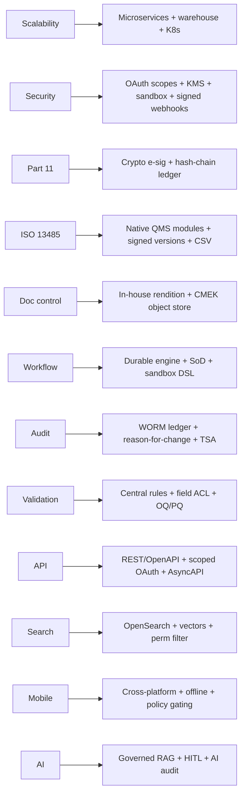

# Phase 11 — Architectural Weaknesses & Remediation

Each weakness is assessed against its **root cause**, **business impact**,
**recommended design**, **recommended technology** and **migration strategy**,
then followed by consolidated **coding / testing / deployment standards**. These
are the problems CloudEIP NextGen (Phases 8–10) exists to solve.

> Framing: most weaknesses are not bugs — they are **gen‑1 App Engine design
> assumptions (Phase 7.4) meeting 2026 regulated‑industry requirements.** What
> made CloudEIP elegant for SMB collaboration is precisely what blocks medical‑
> device compliance.

---

## W1 — Scalability issues

| | |
|---|---|
| **Root cause** | Single‑tenant **monolith per App Engine project** (E‑CLOUD‑07/08); **scale‑to‑zero** cold starts of 5–10 s (E‑CLOUD‑03); 2‑D‑pivot analytics run in‑app over opaque blobs (Phase 1.3); per‑file 7.5 MB cap (E‑FILE‑03). |
| **Business impact** | Cold‑start latency on first use harms UX and SLAs; per‑tenant fleet means **N deployments to patch/validate**; in‑app analytics can't scale to large datasets; no horizontal compute separation for heavy jobs. |
| **Recommended design** | Decompose into stateless microservices behind a gateway (Phase 8.3); push analytics to a **warehouse** (Phase 8.4); offload heavy work to async workers; min‑instances/warm pools to kill cold starts. |
| **Recommended technology** | Kubernetes (GKE/EKS) + HPA/KEDA; BigQuery/Snowflake + dbt; Kafka workers; CDN for static. |
| **Migration strategy** | Strangler‑fig: front CloudEIP with the new gateway; carve out search/reporting first (read‑side), then write‑side domains; dual‑run with CDC into the warehouse. |

## W2 — Security risks

| | |
|---|---|
| **Root cause** | **One shared tenant API key** (`AIza…`, E‑AUTH‑05) with no scopes; **unsigned, fire‑and‑forget webhooks** (Phase 6.7); **synchronous external calls inside form evaluation** (`=@callService`, `url=`, Phase 4.4/6.7); **app‑held AES keys** (E‑DB‑04) with unclear rotation; **raw‑JS `=` evaluator** (E‑BACKEND‑04) — a potential injection/sandbox‑escape surface. |
| **Business impact** | Key leakage = full‑tenant compromise; spoofable webhooks; SSRF/availability coupling to third parties; unclear key custody complicates breach response; arbitrary‑expression risk. |
| **Recommended design** | Scoped **OAuth2 client‑credentials** per integration; **HMAC‑signed webhooks** + retries/DLQ; move external calls **out of the render path** to async connectors; **per‑tenant CMEK** in KMS with crypto‑shredding; **sandboxed** expression engine (GraalJS isolate, no reflection/IO); zero‑trust per‑request authZ (Phase 8.9). |
| **Recommended technology** | Keycloak + API gateway; Vault + KMS/HSM; OPA; GraalVM polyglot isolates; WAF; SIEM/UEBA. |
| **Migration strategy** | Issue scoped tokens alongside the legacy key (deprecate on a clock); wrap outbound calls in a signing proxy; introduce KMS envelope encryption and re‑encrypt blobs on access; replace `=` evaluator with the sandbox behind a feature flag + fuzzing. |

## W3 — 21 CFR Part 11 compliance gaps

| | |
|---|---|
| **Root cause** | "Digital signature" is a **biometric evidence bundle** (selfie+handwrite+GPS+time, E‑SEC‑06), **not** a cryptographic manifest binding *content hash + meaning + identity* (§11.50/11.70); no enforced **second‑component re‑auth** at signing (§11.200); no documented **password/account controls** for signing (§11.300); audit lives in **mutable Datastore** (Phase 3.8). |
| **Business impact** | Records and signatures may be **inadmissible** for FDA‑regulated use; failed inspections; cannot sell into US medical‑device QMS use cases. |
| **Recommended design** | Part 11 **e‑signature service** (Phase 8.11): re‑auth, signed manifest, §11.50 manifestation, uniqueness; **append‑only hash‑chained audit ledger** (Phase 8.10). |
| **Recommended technology** | KMS/HSM signing; TSA for trusted time; immudb/QLDB or WORM‑exported Postgres ledger. |
| **Migration strategy** | Stand up the e‑sig + ledger services; route new signings through them; keep biometric capture as *supplementary* evidence; backfill a provenance event for migrated records (don't claim retroactive Part 11 on legacy signatures). |

## W4 — ISO 13485 compliance gaps

| | |
|---|---|
| **Root cause** | No native **CAPA / Complaint / Change Control / NCR / Supplier / Training / Risk** modules (these are *built by users as forms*, Phase 1); **no signed, diffable document‑/form‑revision register** (zero‑migration coexistence, Phase 4.7); the platform itself isn't presented as a **validated computerised system** (no CSV/GAMP evidence). |
| **Business impact** | Customers must hand‑build regulated processes with no guarantees; auditors can't trace "which controlled revision produced this record"; **system validation burden falls entirely on the customer**. |
| **Recommended design** | Ship the QMS bounded contexts natively (Phase 8.3); **immutable, signed FormDef/Doc versions** (Phase 8.4); deliver the platform **CSV/CSA‑ready** with traceability + OQ/PQ (Phase 9.9). |
| **Recommended technology** | Domain services on Postgres; Flyway forward‑only; pipeline‑generated traceability matrix. |
| **Migration strategy** | Provide validated module templates that *replace* the user‑built forms; map legacy forms to modules via the `import-cloudeip-form` prompt (Phase 10.10.4) with a gap report. |

## W5 — Document‑control weaknesses

| | |
|---|---|
| **Root cause** | Controlled **rendition/printing is templated via consumer Google Sheets** (`template` tab, link‑sharing, E‑FORM‑09); blobs in **Google Drive with link‑based sharing** (E‑FILE‑01); auto‑publish scans an arbitrary Drive folder (W §文件自動上架). |
| **Business impact** | Controlled output depends on a consumer product and link permissions — a **data‑integrity and access‑control hazard**; hard to prove rendition fidelity for audits. |
| **Recommended design** | **In‑house controlled rendition** (headless office→PDF) with manifest stamping; **versioned object store with CMEK** (no link sharing); ingestion via authenticated, validated pipeline (Phase 8.7/10.8). |
| **Recommended technology** | LibreOffice/Gotenberg rendition; GCS/S3 versioned + CMEK; ClamAV on ingest. |
| **Migration strategy** | Re‑render controlled docs through the new pipeline; migrate Drive blobs to the object store; revoke link sharing; replace the Sheets template engine with the rendition service. |

## W6 — Workflow weaknesses

| | |
|---|---|
| **Root cause** | **No segregation of duties** — `signRight` is a single boolean (Phase 5.6); author can be approver; **routing DSL + JS run as bespoke interpreters** (Phase 3.4/4.4) without sandbox/SoD/four‑eyes; flow state is custom Datastore logic (no durable engine). |
| **Business impact** | SoD violations are a top audit finding; bespoke flow code is hard to validate and reason about; recovery/replay is manual. |
| **Recommended design** | **Durable workflow engine** with SoD/four‑eyes gates, e‑signed transitions, regulatory SLA clocks, replayable history (Phase 8.6); typed sandboxed routing evaluator (Phase 10.6). |
| **Recommended technology** | Temporal (or Camunda 8/Zeebe BPMN); GraalJS sandbox. |
| **Migration strategy** | Re‑express the reconstructed CloudEIP semantics (Phase 3) as workflow definitions; shadow‑run against historical instances to confirm equivalence before cutover. |

## W7 — Audit‑trail weaknesses

| | |
|---|---|
| **Root cause** | Audit entries (response history, before/after backups, read receipts) are **stored in the same mutable Datastore** as the data (Phase 3.8); **no hash chain, no WORM, no enforced reason‑for‑change** on every mutation; server epoch‑millis time with no trusted source (E‑BACKEND‑02). |
| **Business impact** | Audit is not **tamper‑evident** → fails ALCOA+ "original/accurate/enduring"; weakens evidentiary value across Part 11 and ISO 13485. |
| **Recommended design** | Dedicated **append‑only, hash‑chained ledger** with periodic chain verification + inspector export; mandatory coded reason‑for‑change; TSA time (Phase 8.10). |
| **Recommended technology** | immudb/QLDB or partitioned Postgres + WORM export; SHA‑256 chaining; TSA. |
| **Migration strategy** | Write‑through new mutations to the ledger immediately; snapshot legacy audit into the ledger as a sealed baseline with provenance. |

## W8 — Validation weaknesses

| | |
|---|---|
| **Root cause** | **No field‑level ACL** (only `protected`/hidden/reverse‑check, Phase 5.4); **two expression evaluators** (DSL + raw JS) increase validation surface; validation logic is per‑form (no central, testable policy); the platform lacks shipped **CSV evidence**. |
| **Business impact** | Inconsistent enforcement; expensive customer‑side validation; risk that computed/validated fields behave differently across form revisions. |
| **Recommended design** | Central, declarative **JSON‑Schema + rule engine** validation (Phase 10.7); first‑class field/record ACL via **PDP (OPA) + RLS** (Phase 8.4/5); single sandboxed evaluator; ship OQ/PQ suites (Phase 9.9). |
| **Recommended technology** | JSON Schema 2020‑12; OPA; GraalJS; Pact/Testcontainers. |
| **Migration strategy** | Extract per‑form validations into central rules during `import-cloudeip-form`; add a regression corpus of real instances to prove parity. |

## W9 — API weaknesses

| | |
|---|---|
| **Root cause** | **RPC‑over‑HTTP** with a `function=` switch and one shared key (Phase 6.2); **no OpenAPI**, no scopes, no documented rate limits/idempotency; thin webhook payloads without signatures. |
| **Business impact** | Hard for partners to integrate safely; weak governance; brittle automation; security exposure (W2). |
| **Recommended design** | **REST + OpenAPI 3.1** (and gRPC internal), scoped OAuth2, idempotency keys, problem+json, **signed/retried webhooks (AsyncAPI)** (Phase 8.5/9.5). |
| **Recommended technology** | API gateway; OpenAPI/AsyncAPI codegen; OAuth2. |
| **Migration strategy** | Publish the new API as `/v1` beside the legacy `/ecm/webservice`; provide an adapter that maps old `function=` calls to new endpoints; deprecate on a clock. |

## W10 — Search weaknesses

| | |
|---|---|
| **Root cause** | Likely **App Engine Search API** (Phase 2.4, conf 65) — capable full‑text but limited faceting/relevance/scale vs modern engines; permission filtering is bespoke; cross‑tenant isolation tied to per‑project deployment. |
| **Business impact** | Limited advanced search/analytics; harder to add semantic/AI search; relevance tuning constrained. |
| **Recommended design** | **OpenSearch/Elasticsearch** indexed off the event bus, with **permission‑filtered queries** and **Tika content extraction**; add **vector search** for semantic/RAG (Phase 8.2/8.8). |
| **Recommended technology** | OpenSearch + Apache Tika; pgvector/Vertex for embeddings. |
| **Migration strategy** | Dual‑index (legacy + OpenSearch) via CDC; cut reads over once parity is confirmed; layer vector search additively. |

## W11 — Mobile weaknesses

| | |
|---|---|
| **Root cause** | Mobile is a **thin native shell over the responsive web app** (E‑MOB‑01/02); **fork for China** without Google services/FCM (E‑MOB‑03); push battery‑throttled on cellular (E‑NOTIF‑02); 系統管理 hidden on mobile "for security" (E‑MOB‑05) rather than properly authorized; offline/poor‑connectivity not addressed. |
| **Business impact** | Two codepaths to maintain (global vs China); inconsistent push timeliness; capability gating by *form factor* not *policy*; weak field‑use story (factory floor, low connectivity). |
| **Recommended design** | One cross‑platform app (React Native/Flutter) with **pluggable push** (FCM/APNs + a China‑safe provider), **policy‑based capability gating** (not device‑based), **offline‑first** sync for inspections/training, secure local storage. |
| **Recommended technology** | React Native/Flutter; FCM/APNs + Jpush/Getui (CN); WatermelonDB/SQLite offline; MDM hooks. |
| **Migration strategy** | Wrap existing web views first; incrementally nativize high‑value flows (sign, capture, training); unify push behind an abstraction. |

## W12 — AI integration weaknesses

| | |
|---|---|
| **Root cause** | **No AI capability today** (absent from all inputs); the opaque‑blob datastore (Phase 2/4) makes content hard to mine; no event log to learn from (Phase 6). |
| **Business impact** | Misses major eQMS value (complaint triage, CAPA drafting, trend/risk detection); competitors with governed AI will pull ahead. |
| **Recommended design** | **Governed AI orchestrator** (Phase 8.8/10.9): tenant‑isolated RAG over *effective* controlled docs, human‑in‑the‑loop, full AI audit log, model‑version pinning under change control, **never the approver of record**. |
| **Recommended technology** | LLM provider via gateway; pgvector/Vertex; FastAPI; guardrails + audit. |
| **Migration strategy** | Start read‑only/advisory (Q&A, duplicate finder) on the new queryable store; add drafting assistants behind mandatory human sign‑off; expand only after validating each agent. |

---

## 11.1 Weakness → remediation traceability

| Severity (regulated‑use lens) | Weaknesses |
|---|---|
| **Critical (blocks regulated sale)** | W3 (Part 11 e‑sig), W7 (tamper‑evident audit), W4 (ISO 13485 modules + validation) |
| **High** | W2 (security), W5 (doc control), W6 (SoD/workflow), W8 (validation) |
| **Medium** | W1 (scalability), W9 (API), W10 (search) |
| **Strategic** | W11 (mobile), W12 (AI) |

---

## 11.2 Coding standards

- **Contract‑first:** OpenAPI/AsyncAPI + event schemas are source of truth; code generated; drift fails CI.
- **Hexagonal architecture:** domain pure and dependency‑free; infra behind ports (Phase 10.2).
- **No raw `eval`:** all expression evaluation through the sandboxed engine; no reflection/IO from user expressions.
- **Mandatory audit + reason:** every mutating handler emits a hash‑chained `AUDIT_EVENT` with a coded reason; controlled transitions require an e‑signature context.
- **Tenant isolation by construction:** every table has `tenant_id` + RLS; audit/ledger tables are INSERT/SELECT‑only at the DB role.
- **Typed everywhere:** Kotlin/TS strict; null‑safety; domain value objects over primitives.
- **Secrets via Vault/KMS only;** no secrets in code, env files committed, or logs.
- **Traceability:** every PR links a requirement ID + risk ID (ISO 14971).

## 11.3 Testing standards

- **Pyramid:** unit (fast, pure domain) → contract (Pact between services) → integration (Testcontainers: real Postgres/Kafka) → E2E (Playwright) → **OQ/PQ** (validation suite for regulated features).
- **Coverage gates:** domain ≥ 90%; security‑critical paths (authz, e‑sig, audit) ≥ 95% + mutation testing.
- **Compliance tests:** audit‑chain verification, SoD enforcement, e‑sig manifest integrity, RLS isolation, expression‑sandbox fuzzing.
- **Migration parity tests:** legacy CloudEIP form/flow corpus replayed for behavioural equivalence.
- **Performance/SLO tests:** p99 latency, soak, and DR (RPO/RTO) drills in the pipeline.

## 11.4 Deployment standards

- **GitOps (Argo CD)** so deployed state continuously matches the **validated** state — eliminating CloudEIP's per‑tenant fleet‑drift (W1).
- **IaC (Terraform + Helm)**, environment parity (dev/validation/prod), no manual changes.
- **Validation‑aware CD (GAMP 5):** automated OQ/PQ + traceability artifact + **Part 11 e‑signed release approval** before prod (Phase 9.9).
- **Progressive delivery:** canary/blue‑green, automated rollback on SLO breach.
- **Supply‑chain security:** SBOM, signed builds (SLSA), provenance, admission control (OPA/Gatekeeper).
- **Per‑tenant version pinning:** upgrades flow through change control; tenants on validated versions until their change record approves the next.
- **DR & retention:** multi‑AZ + DR region, PITR, WORM audit replication, retention enforced per record class.

---

## 11.5 Closing assessment

CloudEIP is a **genuinely well‑engineered SMB collaboration + BPM + DMS suite**
whose architecture is internally consistent and operationally clever for its
era and market (Phase 7.4). Its workflow and form engines are, frankly, more
sophisticated than many enterprise products (Phases 3–4).

But its foundational choices — **opaque encrypted JSON in NoSQL, biometric‑only
signatures, category‑level permissions, consumer‑Sheets coupling, RPC API, and a
mutable, in‑band audit trail** — are exactly the ones a **regulated medical‑
device eQMS cannot accept**. The path forward is not a rewrite of its *ideas*
but a re‑platforming of its *foundations*: keep the dynamic forms, rich
workflow, mobile reach and Google‑grade ops; replace the storage, signature,
audit, permission, API and integration substrates with the compliance‑first
design in Phases 8–10. Done as a **strangler‑fig migration**, CloudEIP's
strengths carry forward while its blocking weaknesses are retired
module‑by‑module.
